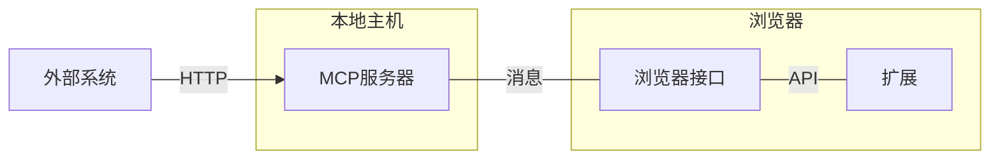

# Chrome Native Messaging Host for MCP SEE Service

## 1. 概述 (Overview)

本文档描述了 Nanobrowser 项目中 MCP (Model Context Protocol) SEE (Surface Extension Environments) 服务的实现方案。该方案通过标准化接口和安全通信模型，使外部 AI 系统能够安全、高效地访问和控制浏览器功能。

### 1.1 MCP SEE 服务简介 (Introduction to MCP SEE Service)

MCP SEE 服务是一种允许外部 AI 系统与浏览器进行标准化交互的接口协议。通过实现该协议，Nanobrowser 使 AI 系统能够：

- 读取浏览器状态（如页面 DOM、截图、标签信息）作为资源
- 执行浏览器操作（如导航、点击、表单填写）作为工具
- 通过标准化协议进行请求和响应

### 1.2 设计目标 (Design Goals)

-   **标准化**: 建立清晰的通信接口，使用统一的 MCP SEE 协议
-   **安全性**: 构建多层安全模型，保护用户浏览数据和本地环境
-   **可扩展性**: 支持丰富的浏览器资源与工具，便于未来扩展
-   **高性能**: 优化本地通信路径，减少延迟和资源消耗
-   **互操作性**: 遵循 MCP 规范，确保与其他 MCP 实现的兼容性

### 1.3 关键概念 (Key Concepts)

- **MCP 服务器**: 运行在本地的应用程序，实现 MCP SEE 协议并转换为浏览器操作
- **浏览器扩展**: Chrome 扩展，负责实际执行浏览器操作和获取浏览器状态
- **浏览器资源**: 通过 URI 访问的浏览器状态信息（如 DOM、截图）
- **浏览器工具**: 可调用的浏览器操作函数（如导航、点击）

### 1.4 通信架构 (Communication Architecture)

本方案采用两层通信模型：

1.  **外部接口层**: 外部 AI 系统通过标准的 MCP SEE 协议（以 HTTP/HTTPS 为载体）与本地 MCP 服务器通信
   - MCP 服务器在本地主机上监听网络端口，接收 MCP 请求
   - 所有外部通信均遵循统一的 MCP SEE 规范，确保标准化和互操作性

2.  **内部接口层**: MCP 服务器通过 Chrome Native Messaging 与浏览器扩展进行安全通信
   - 使用 Chrome 浏览器提供的原生消息传递机制
   - 通过进程间通信（标准输入/输出流）传递指令和结果
   - 确保敏感的浏览器操作通过受保护的通道执行

这种分层设计实现了外部标准化和内部安全性的平衡，同时保持了高性能和灵活性。

### 1.5 方案优势 (Advantages)

-   **标准化接口**: 
    - 所有外部交互遵循 MCP SEE 协议规范
    - 使第三方 AI 系统能够以统一方式访问浏览器功能
    - 支持未来扩展和新功能接入

-   **安全性**:
    - MCP 服务器限制为仅监听本地回环地址 (`127.0.0.1`/`localhost`)
    - Native Messaging 通信受 Chrome 授权机制保护，仅允许特定扩展访问
    - 无需对外开放网络端口，降低攻击面

-   **性能与稳定性**: 
    - 本地进程间通信开销小，响应迅速
    - 使用 Chrome 官方支持的原生机制，稳定可靠
    - 专为高频率浏览器交互优化

-   **隐私保护**: 
    - 所有数据交换主要在用户设备本地完成
    - 可实现细粒度访问控制，防止敏感数据泄露
    - 用户对浏览器操作有完全的可见性和控制权

## 2. 系统架构 (System Architecture)

整体架构设计以分层通信为核心，确保外部标准化与内部安全性的平衡。通过清晰的组件职责划分和标准化接口，系统能够高效地桥接外部 AI 系统与浏览器能力。

### 2.1 整体架构图 (Overall Architecture Diagram)



**图例详解：**
*   **节点说明：**
    - **F (外部系统)**: 外部 AI 系统，是 MCP 请求的发起方，通过 MCP SEE 协议访问浏览器能力
    - **C (MCP服务器)**: Native Host 应用，充当 MCP SEE 服务器和协议转换器，在本地主机上监听网络端口并与浏览器通信
    - **B (浏览器接口)**: Chrome Native Messaging 接口，负责浏览器与本地应用之间的安全进程间通信
    - **A (扩展)**: Chrome 扩展，实际控制浏览器并执行操作的组件

*   **连接说明：**
    - **F → C (HTTP)**: 表示外部 AI 系统通过 MCP/HTTP (遵循 SEE 规范) 向 MCP 服务器发送请求的单向流
    - **C ↔ B (消息)**: 表示 MCP 服务器与浏览器接口之间通过 Chrome Native Messaging (使用 stdin/stdout) 进行的双向通信
    - **B ↔ A (API)**: 表示浏览器接口与 Chrome 扩展之间通过 Chrome Extension APIs 进行的双向交互

*   **子图说明：**
    - **本地主机**: 用户设备上运行 MCP 服务器的环境，负责处理外部请求，转换协议，并与浏览器进行安全通信
    - **浏览器**: Chrome 浏览器环境，包含扩展和原生消息通信接口，实际执行浏览器操作并返回结果

### 2.2 组件职责 (Component Responsibilities)

每个组件在系统中承担特定职责，共同构成完整的通信与操作链路：

-   **外部 AI 系统** (External AI System):
    -   **定位**: MCP 请求的发起方
    -   **职责**: 
        - 构造符合 MCP SEE 规范的请求
        - 读取浏览器资源或调用浏览器工具
        - 处理 MCP 响应结果
    -   **接口**: 使用 HTTP/HTTPS 与 MCP 服务器通信

-   **MCP 服务器** (MCP Server):
    -   **定位**: 协议转换器与服务提供方
    -   **职责**: 
        - 监听网络端口接收 MCP 请求
        - 将 MCP 请求翻译为浏览器操作指令
        - 维护浏览器资源与工具的定义
        - 封装操作结果为标准 MCP 响应
    -   **接口**: 
        - 对外提供 HTTP API
        - 对内使用 Chrome Native Messaging

-   **浏览器接口** (Browser Interface):
    -   **定位**: 进程间通信桥梁
    -   **职责**: 
        - 提供安全的双向消息传递机制
        - 通过标准输入/输出传递指令和结果
    -   **接口**: 
        - 标准化的消息格式
        - 消息长度前缀处理

-   **浏览器扩展** (Browser Extension):
    -   **定位**: 浏览器操作执行者
    -   **职责**: 
        - 接收并解析操作指令
        - 调用 Chrome API 执行浏览器操作
        - 获取浏览器状态信息
        - 将执行结果返回给 MCP 服务器
    -   **接口**: Chrome 扩展 API 和 Native Messaging

### 2.3 数据流 (Data Flow)

以下是系统中一个典型 MCP 请求从发起到响应的完整流程：

1.  **请求发起**: 
    - 外部 AI 系统构造 MCP 请求（如工具调用或资源访问）
    - 通过 HTTP POST 将请求发送到 MCP 服务器（如 `http://localhost:PORT/mcp`）

2.  **请求处理与转换**: 
    - MCP 服务器接收并解析请求
    - 识别请求类型（资源访问或工具调用）
    - 将 MCP 请求转换为浏览器扩展可理解的指令

3.  **内部通信**: 
    - MCP 服务器通过 Chrome Native Messaging 发送指令
    - 指令通过标准输入流传输到浏览器扩展

4.  **浏览器操作执行**: 
    - 浏览器扩展接收并解析指令
    - 调用相应的 Chrome API 执行操作（如导航、点击）
    - 或获取请求的状态信息（如 DOM、标签列表）

5.  **结果返回**: 
    - 浏览器扩展将操作结果或状态信息封装
    - 通过 Native Messaging 返回给 MCP 服务器

6.  **响应生成与发送**: 
    - MCP 服务器将结果转换为标准 MCP 响应格式
    - 通过 HTTP 响应将结果返回给外部 AI 系统

## 3. 通信协议详解 (Detailed Communication Protocols)

系统采用两层通信架构，分别使用不同的协议以确保标准化、安全性和高效性。

### 3.1 外部通信: MCP SEE (External Communication: MCP SEE)

外部通信层基于 MCP SEE 规范，使用 HTTP 作为传输协议：

-   **协议特性**:
    - 基于标准 HTTP/HTTPS，易于集成
    - 遵循 MCP SEE 规范，支持资源访问和工具调用
    - 支持流式响应，适用于长时间运行的操作

-   **请求格式**:
    - 资源访问: `GET /mcp/resource/{资源 URI}`
    - 工具调用: `POST /mcp/call` 携带 JSON 格式的工具名称和参数

-   **响应格式**:
    - 标准 MCP 响应 JSON 结构
    - 包含结果数据或错误信息
    - 对于长时间操作，可使用 SSE (Server-Sent Events) 提供进度更新

-   **安全考虑**:
    - 仅监听本地回环地址 (`localhost/127.0.0.1`)
    - 可选的基于令牌的认证机制
    - 请求频率限制和超时设置

### 3.2 内部通信: Chrome Native Messaging (Internal Communication)

内部通信层使用 Chrome 的 Native Messaging 机制：

-   **机制原理**:
    - 基于进程间通信 (IPC)
    - 使用标准输入/输出流进行通信
    - 由 Chrome 浏览器管理和安全控制

-   **消息格式**:
    - JSON 对象作为基本数据结构
    - 每条消息前添加 4 字节长度前缀 (little-endian)
    - 支持复杂的数据结构和二进制数据（通过 Base64 编码）

-   **通信流程**:
    - MCP 服务器向扩展发送指令时，写入 stdout
    - 浏览器扩展向 MCP 服务器返回结果时，使用 `port.postMessage()`
    - Chrome 浏览器负责消息的路由和安全检查

-   **安全保障**:
    - 通过清单文件 (`manifest.json`) 中的 `allowed_origins` 限制通信对象
    - 仅允许授权的扩展与 MCP 服务器通信
    - 消息通道在本地封闭，不暴露到网络

## 4. 技术组件实现 (Technical Component Implementation)

本节详细介绍系统各组件的技术实现细节，包括代码结构、关键类和函数，以及组件间的交互方式。

### 4.1 MCP 服务器实现 (MCP Server Implementation)

MCP 服务器是整个系统的核心组件，负责协议转换和请求处理。

#### 4.1.1 项目结构 (Project Structure)

MCP 服务器的项目结构遵循模块化设计原则，便于维护和扩展：

```
nanobrowser-mcp-host/
├── src/
│   ├── index.ts              # 主入口: 启动服务器和监听
│   ├── http-mcp-server.ts    # HTTP 服务实现 (外部接口)
│   ├── messaging.ts          # Native Messaging 实现 (内部接口)
│   ├── mcp-service.ts        # MCP 核心逻辑
│   ├── browser-resources.ts  # 浏览器资源定义
│   └── browser-tools.ts      # 浏览器工具定义
├── package.json              # 项目依赖和脚本
├── tsconfig.json             # TypeScript 配置
└── manifest.json             # Native Messaging Host 清单
```

每个模块职责明确，遵循单一职责原则，使代码结构清晰、可维护。

#### 4.1.2 核心模块实现 (Core Modules)

##### HTTP MCP 服务器 (`http-mcp-server.ts`)

实现标准的 MCP Streamable HTTP 传输协议：

```typescript
// 简化示例代码
import express from 'express';
import { randomUUID } from 'node:crypto';
import { McpServer } from '@modelcontextprotocol/sdk/server/mcp.js';
import { StreamableHTTPServerTransport } from '@modelcontextprotocol/sdk/server/streamableHttp.js';
import { isInitializeRequest } from '@modelcontextprotocol/sdk/types.js';

export function createHttpMcpServer() {
  const app = express();
  app.use(express.json());
  
  // 存储会话 ID 到传输实例的映射
  const transports: { [sessionId: string]: StreamableHTTPServerTransport } = {};
  
  // 处理 POST 请求 (客户端到服务器通信)
  app.post('/mcp', async (req, res) => {
    // 检查现有会话 ID
    const sessionId = req.headers['mcp-session-id'] as string | undefined;
    let transport: StreamableHTTPServerTransport;
    
    if (sessionId && transports[sessionId]) {
      // 重用现有传输
      transport = transports[sessionId];
    } else if (!sessionId && isInitializeRequest(req.body)) {
      // 新的初始化请求
      transport = new StreamableHTTPServerTransport({
        sessionIdGenerator: () => randomUUID(),
        onsessioninitialized: (sessionId) => {
          // 存储传输实例和会话 ID 的映射
          transports[sessionId] = transport;
        }
      });
      
      // 当传输关闭时清理资源
      transport.onclose = () => {
        if (transport.sessionId) {
          delete transports[transport.sessionId];
        }
      };
      
      // 创建 MCP 服务器实例
      const server = new McpServer({
        name: "nanobrowser-mcp",
        version: "1.0.0"
      });
      
      // 注册浏览器资源和工具
      registerBrowserResources(server);
      registerBrowserTools(server);
      
      // 连接到传输层
      await server.connect(transport);
    } else {
      // 无效请求
      res.status(400).json({
        jsonrpc: '2.0',
        error: {
          code: -32000,
          message: '错误请求: 未提供有效的会话 ID',
        },
        id: null,
      });
      return;
    }
    
    // 处理请求
    await transport.handleRequest(req, res, req.body);
  });
  
  // 通用处理程序 (GET 和 DELETE)
  const handleSessionRequest = async (req: express.Request, res: express.Response) => {
    const sessionId = req.headers['mcp-session-id'] as string | undefined;
    if (!sessionId || !transports[sessionId]) {
      res.status(400).send('无效或缺失的会话 ID');
      return;
    }
    
    const transport = transports[sessionId];
    await transport.handleRequest(req, res);
  };
  
  // 处理 GET 请求 (服务器到客户端通知, 使用 SSE)
  app.get('/mcp', handleSessionRequest);
  
  // 处理 DELETE 请求 (会话终止)
  app.delete('/mcp', handleSessionRequest);
  
  return app;
}

// 注册浏览器资源函数
function registerBrowserResources(server: McpServer) {
  // 资源注册代码...
}

// 注册浏览器工具函数
function registerBrowserTools(server: McpServer) {
  // 工具注册代码...
}
```

##### 消息处理 (`messaging.ts`)

负责与浏览器扩展的底层通信，使用 MCP SDK 的 StdioServerTransport：

```typescript
// 简化示例代码
import { McpServer } from '@modelcontextprotocol/sdk/server/mcp.js';
import { StdioServerTransport } from '@modelcontextprotocol/sdk/server/stdio.js';
import { registerBrowserResources } from './browser-resources';
import { registerBrowserTools } from './browser-tools';

export class NativeMessagingBridge {
  private stdioTransport: StdioServerTransport;
  private mcpServer: McpServer;
  
  constructor() {
    // 创建 MCP 服务器实例
    this.mcpServer = new McpServer({
      name: "nanobrowser-mcp",
      version: "1.0.0"
    });
    
    // 创建 stdio 传输层
    this.stdioTransport = new StdioServerTransport();
    
    // 注册浏览器资源和工具
    registerBrowserResources(this.mcpServer, this);
    registerBrowserTools(this.mcpServer, this);
  }
  
  // 与扩展通信的方法
  async requestBrowserState() {
    // 向扩展请求浏览器状态
    // 实际实现...
    return {};
  }
  
  async requestTabDom(tabId: number) {
    // 向扩展请求标签页 DOM
    // 实际实现...
    return "";
  }
  
  async requestAllTabs() {
    // 向扩展请求所有标签页信息
    // 实际实现...
    return [];
  }
  
  async executeCommand(command: string, params: any) {
    // 向扩展发送命令
    // 实际实现...
    return { success: true };
  }
  
  async start() {
    // 连接 MCP 服务器到 stdio 传输层
    await this.mcpServer.connect(this.stdioTransport);
    console.error('Native Messaging bridge started using StdioServerTransport');
  }
}
```

##### MCP 服务逻辑 (`mcp-service.ts`)

核心业务逻辑，处理资源访问和工具调用：

```typescript
// 简化示例代码
import { registerResources } from './browser-resources';
import { registerTools } from './browser-tools';

export class McpServiceLogic {
  private resources: Map<string, any> = new Map();
  private tools: Map<string, any> = new Map();
  
  constructor() {
    registerResources(this.resources);
    registerTools(this.tools);
  }
  
  async getResource(uri: string) {
    const resource = this.resources.get(uri);
    if (!resource) {
      throw new Error(`Resource not found: ${uri}`);
    }
    return await resource.fetch();
  }
  
  async callTool(name: string, args: any) {
    const tool = this.tools.get(name);
    if (!tool) {
      throw new Error(`Tool not found: ${name}`);
    }
    return await tool.execute(args);
  }
  
  // 其他方法...
}
```

#### 4.1.3 启动流程 (Startup Process)

主入口 (`index.ts`) 实现系统的启动和生命周期管理，支持两种运行模式：

1. **仅 Native Messaging 模式** - 使用标准输入/输出通信，适用于 Chrome 扩展连接
2. **HTTP + Native Messaging 模式** - 同时提供 HTTP 服务器和标准输入/输出通信

```typescript
// 简化示例代码
import { McpServer } from '@modelcontextprotocol/sdk/server/mcp.js';
import { StdioServerTransport } from '@modelcontextprotocol/sdk/server/stdio.js';
import { createHttpMcpServer } from './http-mcp-server';
import { NativeMessagingBridge } from './messaging';

async function main() {
  try {
    // 检查启动模式
    const runMode = process.env.RUN_MODE || 'stdio';
    
    if (runMode === 'stdio') {
      // 仅 Native Messaging 模式 - 使用 MCP SDK 的 StdioServerTransport
      console.error('Starting in Native Messaging only mode...');
      
      // 创建 MCP 服务器
      const server = new McpServer({
        name: "nanobrowser-mcp",
        version: "1.0.0"
      });
      
      // 创建 stdio 传输层
      const stdioTransport = new StdioServerTransport();
      
      // 注册资源和工具处理程序
      registerBrowserResources(server);
      registerBrowserTools(server);
      
      // 连接服务器到 stdio 传输层
      await server.connect(stdioTransport);
      console.error('MCP server connected to StdioServerTransport');
      
    } else if (runMode === 'http+stdio') {
      // HTTP + Native Messaging 模式
      console.error('Starting in HTTP + Native Messaging mode...');
      
      // 初始化通信桥接器
      const nativeBridge = new NativeMessagingBridge();
      await nativeBridge.start();
      
      // 创建 HTTP 服务器
      const httpServer = createHttpMcpServer();
      
      // 启动 HTTP 服务器
      const PORT = process.env.PORT || 3000;
      httpServer.listen(PORT, '127.0.0.1', () => {
        console.error(`MCP SEE Server listening on http://localhost:${PORT}`);
      });
    } else {
      console.error(`Unknown run mode: ${runMode}`);
      process.exit(1);
    }
    
    // 优雅退出处理
    process.on('SIGINT', () => {
      console.error('Shutting down...');
      process.exit(0);
    });
    
  } catch (error) {
    console.error('Error during startup:', error);
    process.exit(1);
  }
}

// 启动应用
main().catch(error => {
  console.error('Fatal error:', error);
  process.exit(1);
});
```

这种设计提供了更大的灵活性，可以根据不同的需求场景选择运行模式：

- **仅 Native Messaging 模式** - 适合作为 Chrome 扩展的 Native Messaging Host，与浏览器直接通信
- **HTTP + Native Messaging 模式** - 适合同时需要支持浏览器扩展和外部 AI 系统的场景，提供双重接口

### 4.2 Chrome 扩展实现 (Chrome Extension Implementation)

浏览器扩展负责实际执行操作并与 MCP 服务器通信。

#### 4.2.1 扩展结构与配置 (Extension Structure)

##### 扩展清单 (`manifest.json`)

```json
{
  "name": "Nanobrowser Extension",
  "version": "1.0.0",
  "manifest_version": 3,
  "description": "Chrome extension component of Nanobrowser MCP",
  "background": {
    "service_worker": "background.js"
  },
  "permissions": [
    "nativeMessaging",
    "tabs",
    "activeTab",
    "scripting"
  ],
  "host_permissions": [
    "<all_urls>"
  ]
}
```

#### 4.2.2 核心功能实现 (Core Implementation)

##### 后台脚本 (`background.js`)

管理与 MCP 服务器的通信和浏览器操作：

```javascript
// 简化示例代码
// 全局状态
let mcpHostStatus = {
  isConnected: false,
  startTime: null,
  lastHeartbeat: null,
  version: null,
  runMode: null
};

// 1. 连接到 Native Messaging Host
let port;

function connectToMcpHost() {
  try {
    port = chrome.runtime.connectNative('nanobrowser.mcp.host');
    
    // 2. 处理来自 MCP 服务器的消息
    port.onMessage.addListener(async (message) => {
      console.log('Received message from MCP server:', message);
      
      // 更新 MCP Host 状态
      if (message.type === 'status') {
        mcpHostStatus = {
          ...mcpHostStatus,
          ...message.data,
          lastHeartbeat: Date.now()
        };
        // 广播状态更新事件
        chrome.runtime.sendMessage({ 
          type: 'mcpHostStatusUpdate', 
          status: mcpHostStatus 
        });
        return;
      }
      
      try {
        const { command, params } = message;
        let result;
        
        // 3. 根据命令类型执行相应操作
        switch (command) {
          case 'navigate':
            result = await handleNavigate(params.url, params.tabId);
            break;
          case 'click':
            result = await handleClick(params.selector, params.tabId);
            break;
          case 'getDom':
            result = await handleGetDom(params.tabId);
            break;
          // 更多命令处理...
          default:
            throw new Error(`Unknown command: ${command}`);
        }
        
        // 4. 发送结果回 MCP 服务器
        port.postMessage({
          id: message.id,
          result
        });
      } catch (error) {
        // 5. 错误处理
        port.postMessage({
          id: message.id,
          error: error.message
        });
      }
    });
    
    // 处理连接断开
    port.onDisconnect.addListener((p) => {
      const error = chrome.runtime.lastError;
      console.log('MCP host disconnected:', error ? error.message : 'No error');
      
      mcpHostStatus.isConnected = false;
      mcpHostStatus.lastHeartbeat = null;
      
      // 广播断开连接事件
      chrome.runtime.sendMessage({ 
        type: 'mcpHostStatusUpdate', 
        status: mcpHostStatus 
      });
      
      port = null;
    });
    
    // 连接成功，更新状态
    mcpHostStatus.isConnected = true;
    mcpHostStatus.startTime = Date.now();
    
    // 发送初始化请求，获取 MCP Host 详细状态
    port.postMessage({
      type: 'getStatus'
    });
    
    return true;
  } catch (error) {
    console.error('Failed to connect to MCP host:', error);
    return false;
  }
}

// 初始化连接
connectToMcpHost();

// 提供启动/停止 MCP Host 的接口
chrome.runtime.onMessage.addListener((message, sender, sendResponse) => {
  if (message.type === 'getMcpHostStatus') {
    sendResponse(mcpHostStatus);
  } else if (message.type === 'startMcpHost') {
    // 启动 MCP Host 进程
    chrome.runtime.sendNativeMessage('nanobrowser.mcp.host.launcher', {
      action: 'start',
      options: message.options || {}
    }, (response) => {
      if (response && response.success) {
        // 延迟后尝试连接
        setTimeout(() => {
          const connected = connectToMcpHost();
          sendResponse({ success: connected });
        }, 1000);
      } else {
        sendResponse({ success: false, error: response ? response.error : 'Unknown error' });
      }
    });
    return true; // 异步响应
  } else if (message.type === 'stopMcpHost') {
    // 停止 MCP Host 进程
    if (port) {
      // 优雅关闭: 先通知 MCP Host 准备关闭
      port.postMessage({ type: 'shutdown' });
      
      // 然后通过启动器停止进程
      chrome.runtime.sendNativeMessage('nanobrowser.mcp.host.launcher', {
        action: 'stop'
      }, (response) => {
        sendResponse({ success: response && response.success });
      });
    } else {
      // 直接通过启动器停止
      chrome.runtime.sendNativeMessage('nanobrowser.mcp.host.launcher', {
        action: 'stop'
      }, (response) => {
        sendResponse({ success: response && response.success });
      });
    }
    return true; // 异步响应
  }
});

// 操作处理函数
async function handleNavigate(url, tabId) {
  if (!tabId) {
    // 如果没有指定标签页，则在当前活动标签页导航
    const [activeTab] = await chrome.tabs.query({ active: true, currentWindow: true });
    tabId = activeTab.id;
  }
  await chrome.tabs.update(tabId, { url });
  return { success: true };
}

async function handleClick(selector, tabId) {
  // 使用 content script 在页面中点击元素
  return await chrome.scripting.executeScript({
    target: { tabId },
    func: (selector) => {
      const element = document.querySelector(selector);
      if (!element) throw new Error(`Element not found: ${selector}`);
      element.click();
      return { success: true };
    },
    args: [selector]
  });
}

// 更多操作处理函数...

// 定期发送心跳检测 MCP Host 状态
setInterval(() => {
  if (port) {
    try {
      port.postMessage({ type: 'ping' });
    } catch (e) {
      console.log('Failed to send ping:', e);
      // 连接可能已断开，尝试重连
      if (mcpHostStatus.isConnected) {
        mcpHostStatus.isConnected = false;
        chrome.runtime.sendMessage({ 
          type: 'mcpHostStatusUpdate', 
          status: mcpHostStatus 
        });
      }
    }
  }
}, 5000); // 每 5 秒检测一次
```

##### MCP 主机状态监控与控制界面 (`popup.js` 和 `popup.html`)

为扩展提供一个弹出窗口，用于监控 MCP 主机状态并提供启动/停止控制：

```javascript
// popup.js
document.addEventListener('DOMContentLoaded', async () => {
  // 获取 UI 元素
  const statusIndicator = document.getElementById('status-indicator');
  const versionInfo = document.getElementById('version-info');
  const uptime = document.getElementById('uptime');
  const runMode = document.getElementById('run-mode');
  const startButton = document.getElementById('start-button');
  const stopButton = document.getElementById('stop-button');
  const statusSection = document.getElementById('status-section');
  const configSection = document.getElementById('config-section');
  
  // 获取 MCP Host 状态
  const updateStatus = async () => {
    const status = await new Promise(resolve => {
      chrome.runtime.sendMessage({ type: 'getMcpHostStatus' }, resolve);
    });
    
    // 更新 UI
    if (status.isConnected) {
      statusIndicator.className = 'connected';
      statusIndicator.textContent = '运行中';
      startButton.disabled = true;
      stopButton.disabled = false;
      statusSection.style.display = 'block';
      
      // 显示详细信息
      versionInfo.textContent = status.version || '未知';
      runMode.textContent = status.runMode || '未知';
      
      // 计算运行时间
      if (status.startTime) {
        const uptimeMs = Date.now() - status.startTime;
        const hours = Math.floor(uptimeMs / 3600000);
        const minutes = Math.floor((uptimeMs % 3600000) / 60000);
        const seconds = Math.floor((uptimeMs % 60000) / 1000);
        uptime.textContent = `${hours}小时 ${minutes}分钟 ${seconds}秒`;
      } else {
        uptime.textContent = '未知';
      }
    } else {
      statusIndicator.className = 'disconnected';
      statusIndicator.textContent = '未运行';
      startButton.disabled = false;
      stopButton.disabled = true;
      statusSection.style.display = 'none';
    }
  };
  
  // 初始更新状态
  updateStatus();
  
  // 监听状态更新事件
  chrome.runtime.onMessage.addListener((message) => {
    if (message.type === 'mcpHostStatusUpdate') {
      updateStatus();
    }
  });
  
  // 启动 MCP Host
  startButton.addEventListener('click', async () => {
    startButton.disabled = true;
    startButton.textContent = '正在启动...';
    
    // 获取配置选项
    const runMode = document.getElementById('run-mode-select').value;
    const port = document.getElementById('port-input').value;
    
    const result = await new Promise(resolve => {
      chrome.runtime.sendMessage({
        type: 'startMcpHost',
        options: {
          runMode,
          port: port ? parseInt(port, 10) : undefined
        }
      }, resolve);
    });
    
    if (result && result.success) {
      console.log('MCP Host 启动成功');
    } else {
      console.error('MCP Host 启动失败:', result ? result.error : '未知错误');
      alert(`启动失败: ${result ? result.error : '未知错误'}`);
      startButton.disabled = false;
      startButton.textContent = '启动';
    }
    
    updateStatus();
  });
  
  // 停止 MCP Host
  stopButton.addEventListener('click', async () => {
    stopButton.disabled = true;
    stopButton.textContent = '正在停止...';
    
    const result = await new Promise(resolve => {
      chrome.runtime.sendMessage({ type: 'stopMcpHost' }, resolve);
    });
    
    if (result && result.success) {
      console.log('MCP Host 停止成功');
    } else {
      console.error('MCP Host 停止失败');
      alert('停止失败');
    }
    
    stopButton.textContent = '停止';
    updateStatus();
  });
  
  // 显示/隐藏配置部分
  document.getElementById('show-config').addEventListener('click', () => {
    configSection.style.display = configSection.style.display === 'none' ? 'block' : 'none';
  });
});
```

```html
<!-- popup.html -->
<!DOCTYPE html>
<html>
<head>
  <meta charset="UTF-8">
  <title>MCP Host 控制面板</title>
  <style>
    body { width: 300px; font-family: Arial, sans-serif; padding: 10px; }
    .connected { color: green; font-weight: bold; }
    .disconnected { color: red; font-weight: bold; }
    button { margin: 5px; padding: 5px 10px; }
    .status-row { display: flex; justify-content: space-between; margin: 5px 0; }
    .label { font-weight: bold; }
    .divider { border-top: 1px solid #ccc; margin: 10px 0; }
  </style>
</head>
<body>
  <h2>MCP Host 控制面板</h2>
  
  <div class="status-row">
    <span class="label">状态:</span>
    <span id="status-indicator" class="disconnected">未运行</span>
  </div>
  
  <div id="status-section" style="display: none;">
    <div class="status-row">
      <span class="label">版本:</span>
      <span id="version-info">未知</span>
    </div>
    <div class="status-row">
      <span class="label">运行模式:</span>
      <span id="run-mode">未知</span>
    </div>
    <div class="status-row">
      <span class="label">已运行时间:</span>
      <span id="uptime">未知</span>
    </div>
  </div>
  
  <div class="divider"></div>
  
  <div>
    <button id="start-button">启动</button>
    <button id="stop-button" disabled>停止</button>
    <button id="show-config">配置</button>
  </div>
  
  <div id="config-section" style="display: none;">
    <div class="divider"></div>
    <h3>启动配置</h3>
    
    <div class="status-row">
      <span class="label">运行模式:</span>
      <select id="run-mode-select">
        <option value="stdio">仅 Native Messaging</option>
        <option value="http+stdio">HTTP + Native Messaging</option>
      </select>
    </div>
    
    <div class="status-row">
      <span class="label">HTTP 端口:</span>
      <input type="number" id="port-input" placeholder="3000" min="1024" max="65535">
    </div>
  </div>
  
  <script src="popup.js"></script>
</body>
</html>
```

### 4.3 API 组件实现 (API Components)

#### 4.3.1 浏览器资源定义 (`browser-resources.ts`)

使用 MCP TypeScript SDK 的 ResourceTemplate 定义资源:

```typescript
// 简化示例代码
import { McpServer, ResourceTemplate } from "@modelcontextprotocol/sdk/server/mcp.js";
import { NativeMessagingBridge } from "./messaging";

export function registerBrowserResources(server: McpServer, bridge: NativeMessagingBridge) {
  // 定义静态资源 - 当前浏览器状态
  server.resource(
    "browser-state",  // 资源名称
    "browser://current/state",  // 资源 URI
    async (uri) => {
      // 通过 Native Messaging 获取浏览器当前状态
      const result = await bridge.requestBrowserState();
      return {
        contents: [{
          uri: uri.href,
          text: JSON.stringify(result)
        }]
      };
    }
  );
  
  // 定义动态资源 - 指定标签页 DOM
  server.resource(
    "tab-dom",
    new ResourceTemplate("browser://tabs/{tabId}/dom", { list: undefined }),
    async (uri, { tabId }) => {
      // 通过 Native Messaging 获取指定标签页的 DOM
      const result = await bridge.requestTabDom(tabId);
      return {
        contents: [{
          uri: uri.href,
          text: result
        }]
      };
    }
  );
  
  // 定义资源 - 所有标签页
  server.resource(
    "all-tabs",
    "browser://tabs",
    async (uri) => {
      // 通过 Native Messaging 获取所有标签页信息
      const result = await bridge.requestAllTabs();
      return {
        contents: [{
          uri: uri.href,
          text: JSON.stringify(result)
        }]
      };
    }
  );
}
```

#### 4.3.2 浏览器工具定义 (`browser-tools.ts`)

使用 MCP TypeScript SDK 的工具注册 API 和 Zod 验证:

```typescript
// 简化示例代码
import { McpServer } from "@modelcontextprotocol/sdk/server/mcp.js";
import { NativeMessagingBridge } from "./messaging";
import { z } from "zod";

export function registerBrowserTools(server: McpServer, bridge: NativeMessagingBridge) {
  // 定义导航工具
  server.tool(
    "navigate_to",
    { url: z.string().url() },
    async ({ url }) => {
      // 通过 Native Messaging 执行导航
      const result = await bridge.executeCommand("navigate", { url });
      return {
        content: [{ 
          type: "text", 
          text: `成功导航到 ${url}` 
        }]
      };
    }
  );
  
  // 定义点击元素工具
  server.tool(
    "click_element",
    {
      selector: z.string(),
      tabId: z.number().optional()
    },
    async ({ selector, tabId }) => {
      // 通过 Native Messaging 执行点击
      const result = await bridge.executeCommand("click", { selector, tabId });
      return {
        content: [{ 
          type: "text", 
          text: `成功点击元素 ${selector}` 
        }]
      };
    }
  );
  
  // 定义输入文本工具
  server.tool(
    "input_text",
    {
      selector: z.string(),
      text: z.string(),
      tabId: z.number().optional()
    },
    async ({ selector, text, tabId }) => {
      // 通过 Native Messaging 执行文本输入
      const result = await bridge.executeCommand("inputText", { selector, text, tabId });
      return {
        content: [{ 
          type: "text", 
          text: `成功在 ${selector} 输入文本` 
        }]
      };
    }
  );
  
  // 更多工具定义...
}
```

## 5. 部署指南 (Deployment Guide)

本节提供详细的安装、配置和部署说明，确保系统能够正确运行在用户环境中。

### 5.1 环境要求 (Environment Requirements)

成功部署和运行 Nanobrowser MCP 系统需要以下环境：

- **操作系统**: Windows 10+, macOS 10.14+, 或 Linux (主流发行版)
- **Node.js**: v14.0.0 或更高版本
- **Chrome 浏览器**: 版本 88 或更高
- **网络环境**: 本地端口 3000 (默认) 可用

### 5.2 安装步骤 (Installation Steps)

#### 5.2.1 MCP 服务器安装

1. **获取代码**:
   ```bash
   git clone https://github.com/your-org/nanobrowser-mcp.git
   cd nanobrowser-mcp/mcp-host
   ```

2. **安装依赖**:
   ```bash
   npm install
   ```

3. **构建项目**:
   ```bash
   npm run build
   ```

4. **注册 Native Messaging Host**:

   创建适合您操作系统的清单文件 `nanobrowser.mcp.host.json`：

   ```json
   {
     "name": "nanobrowser.mcp.host",
     "description": "Nanobrowser MCP Native Messaging Host",
     "path": "ABSOLUTE_PATH_TO_EXECUTABLE",
     "type": "stdio",
     "allowed_origins": [
       "chrome-extension://YOUR_EXTENSION_ID/"
     ]
   }
   ```

   然后根据您的操作系统，将此文件放置在正确位置：

   **Windows**:
   - 将清单路径添加到注册表
   ```
   REG ADD "HKCU\Software\Google\Chrome\NativeMessagingHosts\nanobrowser.mcp.host" /ve /t REG_SZ /d "FULL_PATH_TO_MANIFEST" /f
   ```

   **macOS**:
   ```bash
   mkdir -p ~/Library/Application\ Support/Google/Chrome/NativeMessagingHosts/
   cp nanobrowser.mcp.host.json ~/Library/Application\ Support/Google/Chrome/NativeMessagingHosts/
   ```

   **Linux**:
   ```bash
   mkdir -p ~/.config/google-chrome/NativeMessagingHosts/
   cp nanobrowser.mcp.host.json ~/.config/google-chrome/NativeMessagingHosts/
   ```

#### 5.2.2 Chrome 扩展安装

1. **加载扩展**:
   - 打开 Chrome 浏览器并访问 `chrome://extensions/`
   - 启用开发者模式 (右上角的开关)
   - 点击 "加载已解压的扩展程序" 按钮
   - 选择 `nanobrowser-mcp/chrome-extension` 目录

2. **获取扩展 ID**:
   - 在扩展卡片上找到扩展 ID
   - 更新 Native Messaging Host 清单中的 `allowed_origins` 字段

3. **验证连接**:
   - 重启 Chrome 浏览器
   - 打开扩展的开发者工具 (右键点击扩展图标，选择 "检查")
   - 检查控制台日志，确认与 Native Messaging Host 的连接成功

### 5.3 配置说明 (Configuration)

#### 5.3.1 MCP 服务器配置

MCP 服务器支持通过环境变量或配置文件自定义以下参数：

| 配置项 | 描述 | 默认值 | 示例 |
|--------|------|---------|-------|
| `PORT` | HTTP 服务器监听端口 | `3000` | `PORT=8080` |
| `HOST` | HTTP 服务器绑定地址 | `127.0.0.1` | `HOST=localhost` |
| `LOG_LEVEL` | 日志级别 | `info` | `LOG_LEVEL=debug` |
| `AUTH_TOKEN` | API 认证令牌 (可选) | 无 | `AUTH_TOKEN=secret123` |

示例配置文件 `.env`：
```
PORT=3456
LOG_LEVEL=debug
AUTH_TOKEN=your-secure-token
```

#### 5.3.2 Chrome 扩展配置

扩展配置通过选项页面进行管理，可配置的选项包括：

- 允许的网站域名
- 操作权限级别
- 自动化操作的限制
- 日志和通知设置

## 6. 安全考虑 (Security Considerations)

### 6.1 潜在风险

-   **MCP 服务器端口暴露**: 如果 Native Host/MCP 服务器监听的端口未受适当保护，可能被本地网络上的其他应用访问。
-   **权限过度**: Chrome 扩展本身拥有较多权限。
-   **数据泄露**: 通过 MCP 资源暴露的浏览器状态可能包含敏感信息。
-   **恶意操作**: 外部 AI 系统可能通过 MCP 工具请求执行潜在的恶意浏览器操作。

### 6.2 缓解措施

1.  **保护 MCP 服务器端口**:
    -   默认情况下，Native Host/MCP 服务器应仅监听本地回环地址 (`127.0.0.1` 或 `localhost`)，防止来自外部网络的直接访问。
    -   考虑添加认证机制到 MCP SEE 服务接口，如果需要更强的访问控制。
2.  **限制 Native Messaging Host 访问**:
    -   `allowed_origins` 确保只有指定的 Chrome 扩展可以与 Native Host 通信。
3.  **操作白名单与权限控制**:
    -   在 MCP 服务层面实现对可调用工具和可访问资源的细粒度控制。
    -   考虑限制工具可操作的网站域。
4.  **用户通知和控制**:
    -   Chrome 扩展在请求敏感权限时会有提示。
    -   考虑在扩展 UI 中提供用户对 MCP 服务功能的控制开关或日志审计。
5.  **数据最小化**:
    -   MCP 资源应仅暴露必要的信息。
    -   避免通过 MCP 自动传输敏感表单数据或凭据。
6.  **输入验证**:
    -   Native Host/MCP 服务器必须严格验证所有来自外部 AI 系统的 MCP 工具参数，防止注入等攻击。

## 7. API 参考 (MCP SEE Service API Reference)

此部分指的是 Native Host/MCP 服务器通过其网络接口 (例如 HTTP) 向外部 AI 系统暴露的 MCP SEE API。

### 7.1 暴露的 MCP 资源

| 资源 URI                | 描述                                     |
| ----------------------- | ---------------------------------------- |
| `browser://current/state` | 当前浏览器状态，包括活动页面和所有标签页 |
| `browser://current/dom`   | 当前活动页面的 DOM 结构 (简化版)         |
| `browser://tabs`          | 所有打开的标签页信息列表                 |

### 7.2 暴露的 MCP 工具

| 工具名称        | 描述                             | Zod 参数验证                                                    | 输入参数示例                                          |
| --------------- | -------------------------------- | --------------------------------------------------------------- | ----------------------------------------------------- |
| `navigate_to`   | 导航到指定 URL                   | `{ url: z.string().url() }`                                     | `{ "url": "https://example.com" }`                    |
| `click_element` | 点击指定的元素 (通过 CSS 选择器) | `{ selector: z.string(), tabId: z.number().optional() }`        | `{ "selector": "#submit-button", "tabId": 123 }`      |
| `input_text`    | 在指定输入元素中输入文本         | `{ selector: z.string(), text: z.string(), tabId: z.number().optional() }` | `{ "selector": "#search", "text": "查询内容" }`       |
| `submit_form`   | 提交指定的表单 (通过 CSS 选择器) | `{ selector: z.string(), tabId: z.number().optional() }`        | `{ "selector": "form#login" }`                        |
| `open_tab`      | 打开新的标签页并导航到 URL       | `{ url: z.string().url() }`                                     | `{ "url": "https://example.com" }`                    |
| `close_tab`     | 关闭指定的标签页 (通过 ID)       | `{ tabId: z.number() }`                                         | `{ "tabId": 123 }`                                    |
| `switch_tab`    | 切换到指定的标签页 (通过 ID)     | `{ tabId: z.number() }`                                         | `{ "tabId": 123 }`                                    |
| `get_screenshot`| 获取指定标签页的截图             | `{ tabId: z.number().optional(), fullPage: z.boolean().optional() }` | `{ "tabId": 123, "fullPage": true }`                 |
| `scroll_page`   | 滚动页面                         | `{ direction: z.enum(["up", "down"]), amount: z.number().optional(), tabId: z.number().optional() }` | `{ "direction": "down", "amount": 500 }` |

*(注意: Zod 参数验证是在 MCP 服务器端实现的类型安全验证，输入参数示例是客户端调用时实际发送的 JSON 对象)*

## 8. 总结 (Summary)

本文档详细描述了 Nanobrowser 项目中 MCP SEE 服务的实现方案。该方案通过一个两层通信架构，使外部 AI 系统能够与 Chrome 浏览器进行交互：

1.  **外部接口**: 外部 AI 系统使用标准的 MCP SEE 协议 (例如，通过 HTTP) 与在用户本地主机上运行的 Native Host 应用（作为 MCP 服务器）通信。该服务器监听一个网络端口，处理 MCP 请求和响应。
2.  **内部接口**: Native Host 应用（MCP 服务器）则通过 Chrome Native Messaging 与 Chrome 扩展进行安全的本地通信，将外部请求转化为实际的浏览器操作，并获取结果。

这种设计分离了外部网络接口和内部浏览器交互，兼顾了标准化、安全性和功能性，为外部 AI 系统提供了一个强大而受控的浏览器自动化能力接口。
