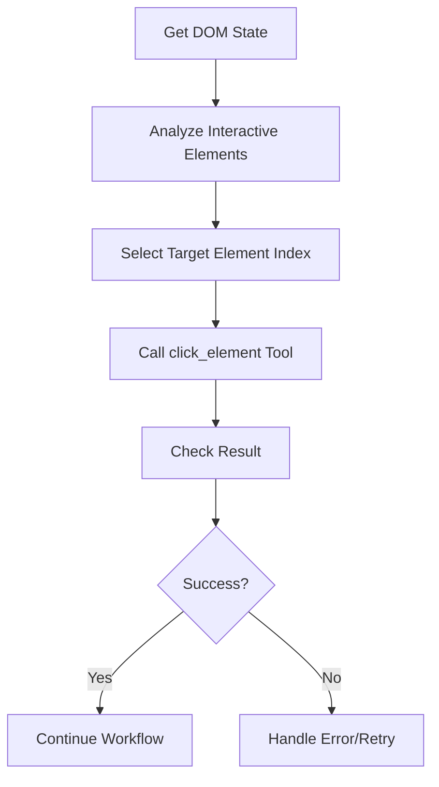

# Click Element Tool Design Document

## Overview

The `click_element` tool is a simplified MCP tool designed for external AI systems to click interactive elements on web pages. This tool follows the established patterns in the Algonius Browser MCP server and prioritizes simplicity and reliability over complex features.

## Tool Identification

- **Tool Name**: `click_element`
- **Category**: Browser Interaction Tool
- **Version**: 1.0.0
- **Dependencies**: Algonius Browser MCP server, DOM state system

## Design Philosophy

This tool is specifically designed for external AI systems with the following principles:

1. **Simplicity First**: Minimal parameters to reduce cognitive load
2. **Reliability**: Use the most reliable element identification method (index)
3. **Integration**: Perfect integration with existing DOM pagination system
4. **Workflow Alignment**: Fits naturally into "get info → select → act" pattern

## Core Features

1. **Index-Based Clicking**: Primary and only element identification method
2. **Wait Control**: Optional post-click waiting for page responses
3. **Page Change Detection**: Automatically detect if click caused navigation
4. **Simple Error Handling**: Clear, actionable error messages

## Input Parameters

### Parameter Schema

```json
{
  "type": "object",
  "properties": {
    "element_index": {
      "type": "number",
      "description": "Index of the element to click (0-based, from DOM state interactive_elements)",
      "minimum": 0
    },
    "wait_after": {
      "type": "number", 
      "description": "Time to wait after clicking (seconds)",
      "minimum": 0,
      "maximum": 30,
      "default": 1
    }
  },
  "required": ["element_index"]
}
```

### Parameter Details

| Parameter | Type | Required | Default | Description |
|-----------|------|----------|---------|-------------|
| `element_index` | number | ✅ | - | Index of target element from DOM state |
| `wait_after` | number | ❌ | 1 | Wait time after click (0-30 seconds) |

### Usage Examples

#### Basic Click
```json
{
  "element_index": 2
}
```

#### Click with Wait
```json
{
  "element_index": 5,
  "wait_after": 3
}
```

#### No Wait Click
```json
{
  "element_index": 0,
  "wait_after": 0
}
```

## Output Format

### Success Response

```json
{
  "success": true,
  "message": "Successfully clicked element at index 2",
  "element_info": {
    "index": 2,
    "text": "Login Button",
    "tag_name": "button",
    "id": "login-btn"
  },
  "page_changed": false,
  "execution_time": 1.2
}
```

### Error Response

```json
{
  "success": false,
  "message": "Element at index 5 not found or not clickable",
  "error_code": "ELEMENT_NOT_CLICKABLE",
  "element_index": 5,
  "execution_time": 0.8
}
```

### Response Fields

| Field | Type | Description |
|-------|------|-------------|
| `success` | boolean | Whether the operation succeeded |
| `message` | string | Human-readable result description |
| `element_info` | object | Information about clicked element (success only) |
| `page_changed` | boolean | Whether click caused page navigation |
| `execution_time` | number | Operation duration in seconds |
| `error_code` | string | Error identifier (failure only) |
| `element_index` | number | Requested element index (failure only) |

## Error Codes

| Code | Description | Resolution |
|------|-------------|------------|
| `INVALID_INDEX` | Element index out of range | Check DOM state for valid indices |
| `ELEMENT_NOT_FOUND` | Element at index doesn't exist | Refresh DOM state and retry |
| `ELEMENT_NOT_CLICKABLE` | Element exists but not clickable | Element may be disabled or hidden |
| `CLICK_FAILED` | Click operation failed | Browser error, retry may help |
| `TIMEOUT_ERROR` | Operation timed out | Check page responsiveness |

## Recommended AI Workflow



### Integration with Existing Tools

1. **Get DOM Elements**: Use `get_dom_extra_elements` or `browser://dom/state`
2. **Select Element**: AI analyzes available elements and chooses index
3. **Click Element**: Use this tool with selected index
4. **Verify Result**: Check success and page_changed status

### Example AI Integration

```python
# Step 1: Get available buttons
buttons = mcp_client.call_tool("get_dom_extra_elements", {
    "elementType": "button"
})

# Step 2: AI analyzes and selects login button
login_button_index = find_element_by_text(buttons, "login")

# Step 3: Click the button
result = mcp_client.call_tool("click_element", {
    "element_index": login_button_index,
    "wait_after": 2
})

# Step 4: Handle result
if result.success and result.page_changed:
    print("Login page loaded successfully")
```

## Implementation Architecture

### Go Tool Structure
- Implements MCP tool interface
- Parameter validation with comprehensive error messages
- Native messaging integration for Chrome extension communication
- Structured logging for debugging

### Chrome Extension Handler
- Follows established RPC handler pattern
- Element lookup using current DOM state
- Click execution with error handling
- Page change detection

### Integration Points
- Uses existing DOM state system
- Leverages current element indexing
- Follows established error handling patterns
- Maintains consistency with other tools

## Testing Strategy

### Unit Tests
- Parameter validation
- Error handling scenarios
- Response formatting

### Integration Tests
- Basic element clicking
- Page navigation detection
- Error scenarios (invalid index, non-clickable elements)
- Wait timing validation

### Test Scenarios
1. **Valid Click**: Click existing, clickable element
2. **Invalid Index**: Out of range element index
3. **Non-Clickable**: Hidden or disabled element
4. **Page Navigation**: Click that triggers page change
5. **Timing**: Various wait_after values

## Performance Considerations

- **Fast Execution**: Typically completes in under 2 seconds
- **Minimal DOM Queries**: Reuses existing DOM state data
- **Efficient Waiting**: Only waits when explicitly requested
- **Error Fast-Fail**: Quick error detection and reporting

## Security Considerations

- **Index Validation**: Prevents out-of-bounds access
- **Element Verification**: Ensures element is actually clickable
- **Timeout Protection**: Prevents infinite waiting
- **Safe Defaults**: Conservative default values

## Future Enhancements

While this version prioritizes simplicity, potential future additions could include:

- **Multiple Click Types**: Right-click, double-click support
- **Coordinate Clicking**: Click at specific coordinates
- **Modifier Keys**: Click with Ctrl, Shift, etc.
- **Batch Operations**: Click multiple elements in sequence

## Compatibility

- **Chrome**: Primary target browser
- **Firefox**: Secondary support
- **Edge**: Basic compatibility
- **MCP Protocol**: Fully compliant with MCP standard

---

**Document Version**: 1.0.0  
**Last Updated**: 2025-05-27  
**Maintainer**: Algonius Browser Team
