# MCP Host 状态监控与控制设计方案

## 1. 需求概述

为Chrome扩展实现对MCP Host的状态监控和控制功能，包括：

- 查看MCP Host的运行状态（是否运行、版本、运行时间等）
- 启动MCP Host（支持配置运行模式和端口）
- 停止MCP Host（支持优雅关闭）

## 2. 整体架构设计

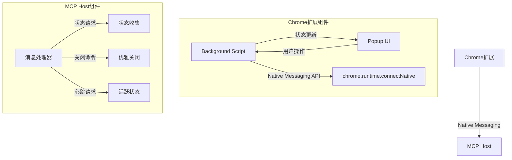
```mermaid
graph TD
    A[Chrome扩展] -->|Native Messaging| B[MCP Host]
    
    subgraph "Chrome扩展组件"
        C[Background Script] -->|状态更新| D[Popup UI]
        D -->|用户操作| C
        C -->|Native Messaging API| E[chrome.runtime.connectNative]
    end
    
    subgraph "MCP Host组件"
        F[消息处理器] -->|状态请求| G[状态收集]
        F -->|关闭命令| H[优雅关闭]
        F -->|心跳请求| I[活跃状态]
    end
```

## 3. 组件详细设计

### 3.1 Chrome扩展组件

#### 3.1.1 Background Script (MCP Host Manager)

**职责与功能**:
- 管理与MCP Host的连接状态
- 通过Native Messaging与MCP Host通信
- 发送心跳检测、状态请求等命令
- 处理MCP Host启动和停止
- 维护和广播MCP Host状态

**接口定义**:

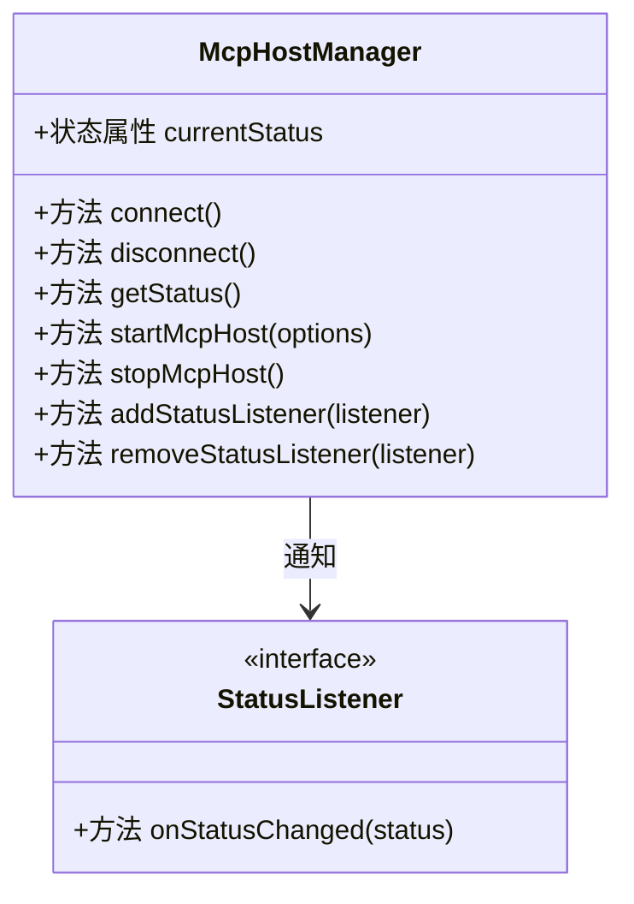
```mermaid
classDiagram
    class McpHostManager {
        +状态属性 currentStatus
        +方法 connect()
        +方法 disconnect()
        +方法 getStatus()
        +方法 startMcpHost(options)
        +方法 stopMcpHost()
        +方法 addStatusListener(listener)
        +方法 removeStatusListener(listener)
    }
    
    class StatusListener {
        <<interface>>
        +方法 onStatusChanged(status)
    }
    
    McpHostManager --> StatusListener : 通知
```

**状态管理模型**:

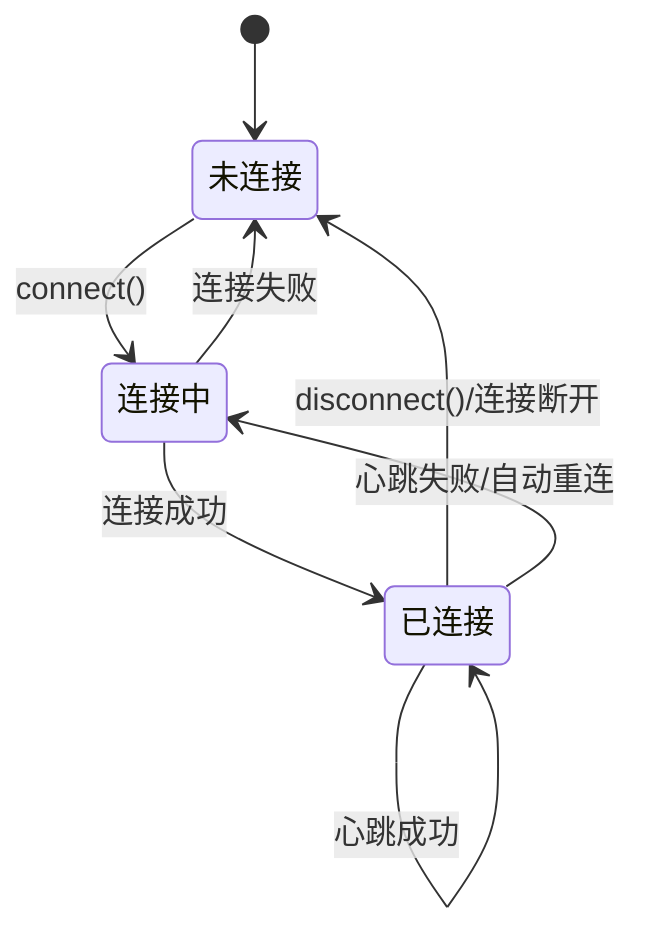
```mermaid
stateDiagram-v2
    [*] --> 未连接
    未连接 --> 连接中: connect()
    连接中 --> 已连接: 连接成功
    连接中 --> 未连接: 连接失败
    已连接 --> 未连接: disconnect()/连接断开
    已连接 --> 已连接: 心跳成功
    已连接 --> 连接中: 心跳失败/自动重连
```

**业务流程 - 心跳机制**:

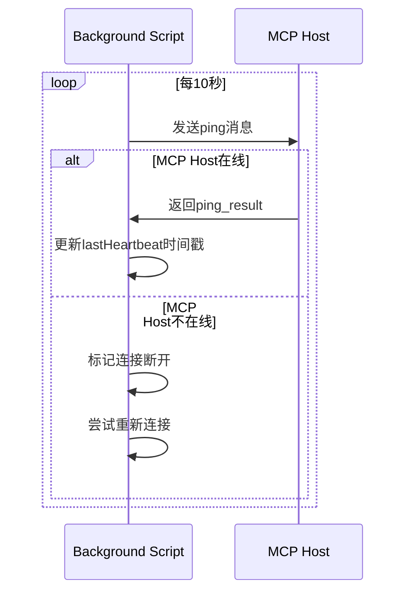
```mermaid
sequenceDiagram
    participant BG as Background Script
    participant MH as MCP Host
    
    loop 每10秒
        BG->>MH: 发送ping消息
        alt MCP Host在线
            MH->>BG: 返回ping_result
            BG->>BG: 更新lastHeartbeat时间戳
        else MCP Host不在线
            BG->>BG: 标记连接断开
            BG->>BG: 尝试重新连接
        end
    end
```

**业务流程 - 启动MCP Host**:

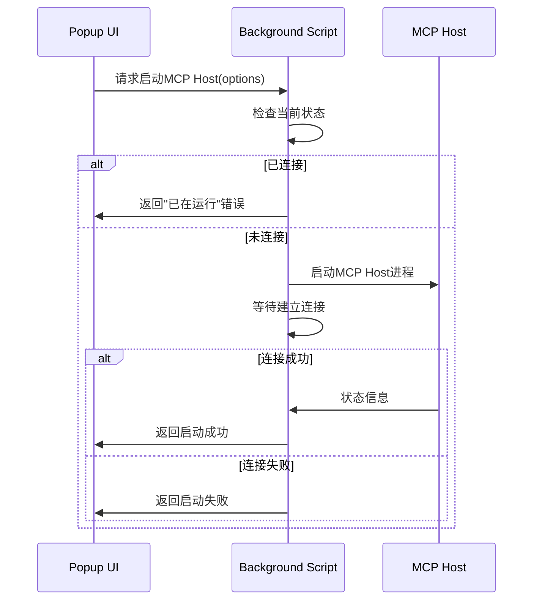
```mermaid
sequenceDiagram
    participant UI as Popup UI
    participant BG as Background Script
    participant MH as MCP Host
    
    UI->>BG: 请求启动MCP Host(options)
    BG->>BG: 检查当前状态
    alt 已连接
        BG->>UI: 返回"已在运行"错误
    else 未连接
        BG->>MH: 启动MCP Host进程
        BG->>BG: 等待建立连接
        alt 连接成功
            MH->>BG: 状态信息
            BG->>UI: 返回启动成功
        else 连接失败
            BG->>UI: 返回启动失败
        end
    end
```

**业务流程 - 停止MCP Host**:

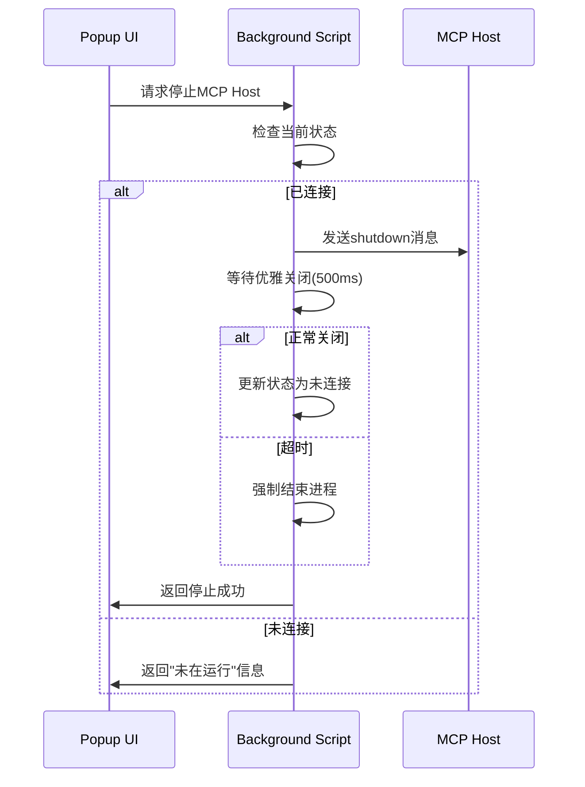
```mermaid
sequenceDiagram
    participant UI as Popup UI
    participant BG as Background Script
    participant MH as MCP Host
    
    UI->>BG: 请求停止MCP Host
    BG->>BG: 检查当前状态
    alt 已连接
        BG->>MH: 发送shutdown消息
        BG->>BG: 等待优雅关闭(500ms)
        alt 正常关闭
            BG->>BG: 更新状态为未连接
        else 超时
            BG->>BG: 强制结束进程
        end
        BG->>UI: 返回停止成功
    else 未连接
        BG->>UI: 返回"未在运行"信息
    end
```

#### 3.1.2 Popup UI

**界面组件设计**:

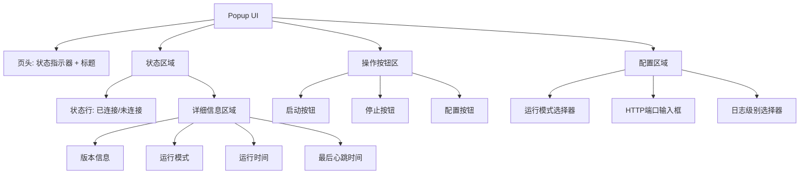
```mermaid
graph TD
    UI[Popup UI] --> Header[页头: 状态指示器 + 标题]
    UI --> StatusSection[状态区域]
    UI --> ActionButtons[操作按钮区]
    UI --> ConfigSection[配置区域]
    
    StatusSection --> StatusRow[状态行: 已连接/未连接]
    StatusSection --> DetailsArea[详细信息区域]
    
    DetailsArea --> VersionInfo[版本信息]
    DetailsArea --> RunModeInfo[运行模式]
    DetailsArea --> UptimeInfo[运行时间]
    DetailsArea --> HeartbeatInfo[最后心跳时间]
    
    ActionButtons --> StartButton[启动按钮]
    ActionButtons --> StopButton[停止按钮]
    ActionButtons --> ConfigButton[配置按钮]
    
    ConfigSection --> RunModeSelect[运行模式选择器]
    ConfigSection --> PortInput[HTTP端口输入框]
    ConfigSection --> LogLevelSelect[日志级别选择器]
```

**交互流程**:

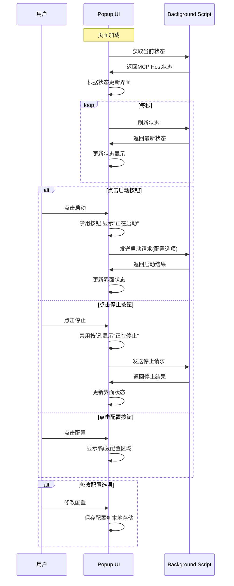
```mermaid
sequenceDiagram
    participant User as 用户
    participant UI as Popup UI
    participant BG as Background Script
    
    Note over UI: 页面加载
    UI->>BG: 获取当前状态
    BG->>UI: 返回MCP Host状态
    UI->>UI: 根据状态更新界面
    
    loop 每秒
        UI->>BG: 刷新状态
        BG->>UI: 返回最新状态
        UI->>UI: 更新状态显示
    end
    
    alt 点击启动按钮
        User->>UI: 点击启动
        UI->>UI: 禁用按钮,显示"正在启动"
        UI->>BG: 发送启动请求(配置选项)
        BG->>UI: 返回启动结果
        UI->>UI: 更新界面状态
    else 点击停止按钮
        User->>UI: 点击停止
        UI->>UI: 禁用按钮,显示"正在停止"
        UI->>BG: 发送停止请求
        BG->>UI: 返回停止结果
        UI->>UI: 更新界面状态
    else 点击配置按钮
        User->>UI: 点击配置
        UI->>UI: 显示/隐藏配置区域
    end
    
    alt 修改配置选项
        User->>UI: 修改配置
        UI->>UI: 保存配置到本地存储
    end
```

**数据模型**:

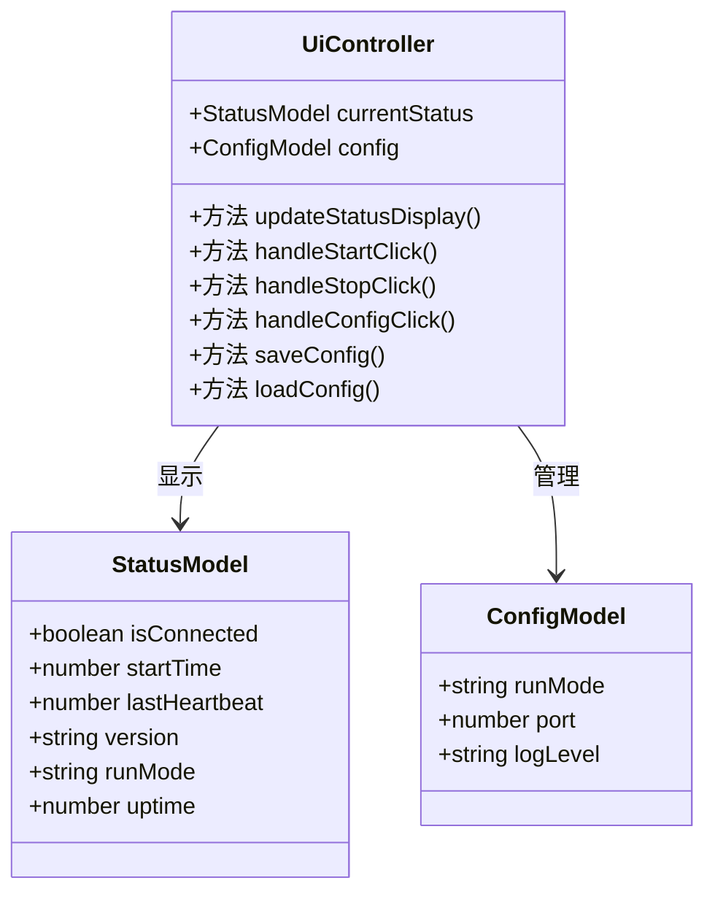
```mermaid
classDiagram
    class StatusModel {
        +boolean isConnected
        +number startTime
        +number lastHeartbeat
        +string version
        +string runMode
        +number uptime
    }
    
    class ConfigModel {
        +string runMode
        +number port
        +string logLevel
    }
    
    class UiController {
        +StatusModel currentStatus
        +ConfigModel config
        +方法 updateStatusDisplay()
        +方法 handleStartClick()
        +方法 handleStopClick()
        +方法 handleConfigClick()
        +方法 saveConfig()
        +方法 loadConfig()
    }
    
    UiController --> StatusModel : 显示
    UiController --> ConfigModel : 管理
```

### 3.2 MCP Host组件

#### 3.2.1 消息处理器

**消息处理流程**:

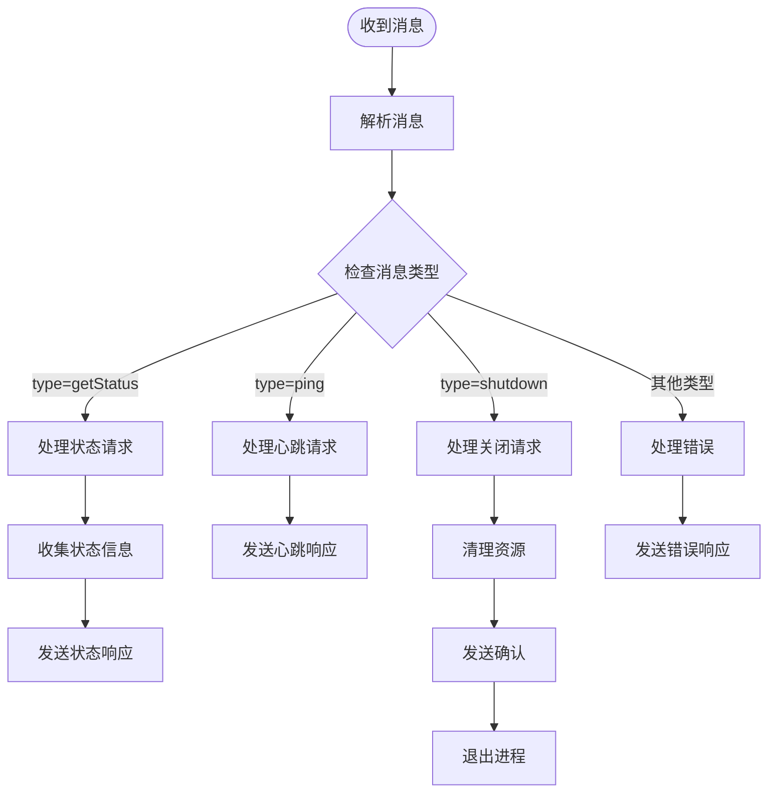
```mermaid
flowchart TD
    Start([收到消息]) --> ParseMessage[解析消息]
    ParseMessage --> TypeCheck{检查消息类型}
    
    TypeCheck -- type=getStatus --> HandleStatus[处理状态请求]
    HandleStatus --> CollectStatus[收集状态信息]
    CollectStatus --> SendStatus[发送状态响应]
    
    TypeCheck -- type=ping --> HandlePing[处理心跳请求]
    HandlePing --> SendPing[发送心跳响应]
    
    TypeCheck -- type=shutdown --> HandleShutdown[处理关闭请求]
    HandleShutdown --> CleanUp[清理资源]
    CleanUp --> SendConfirm[发送确认]
    SendConfirm --> Exit[退出进程]
    
    TypeCheck -- 其他类型 --> Error[处理错误]
    Error --> SendError[发送错误响应]
```

**消息处理器接口定义**:

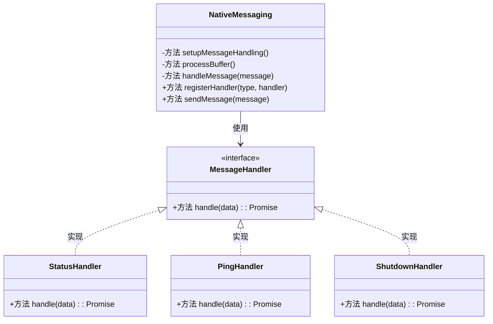
```mermaid
classDiagram
    class NativeMessaging {
        -方法 setupMessageHandling()
        -方法 processBuffer()
        -方法 handleMessage(message)
        +方法 registerHandler(type, handler)
        +方法 sendMessage(message)
    }
    
    class MessageHandler {
        <<interface>>
        +方法 handle(data) : Promise
    }
    
    class StatusHandler {
        +方法 handle(data) : Promise
    }
    
    class PingHandler {
        +方法 handle(data) : Promise
    }
    
    class ShutdownHandler {
        +方法 handle(data) : Promise
    }
    
    NativeMessaging --> MessageHandler : 使用
    MessageHandler <|.. StatusHandler : 实现
    MessageHandler <|.. PingHandler : 实现
    MessageHandler <|.. ShutdownHandler : 实现
```

**优雅关闭流程**:

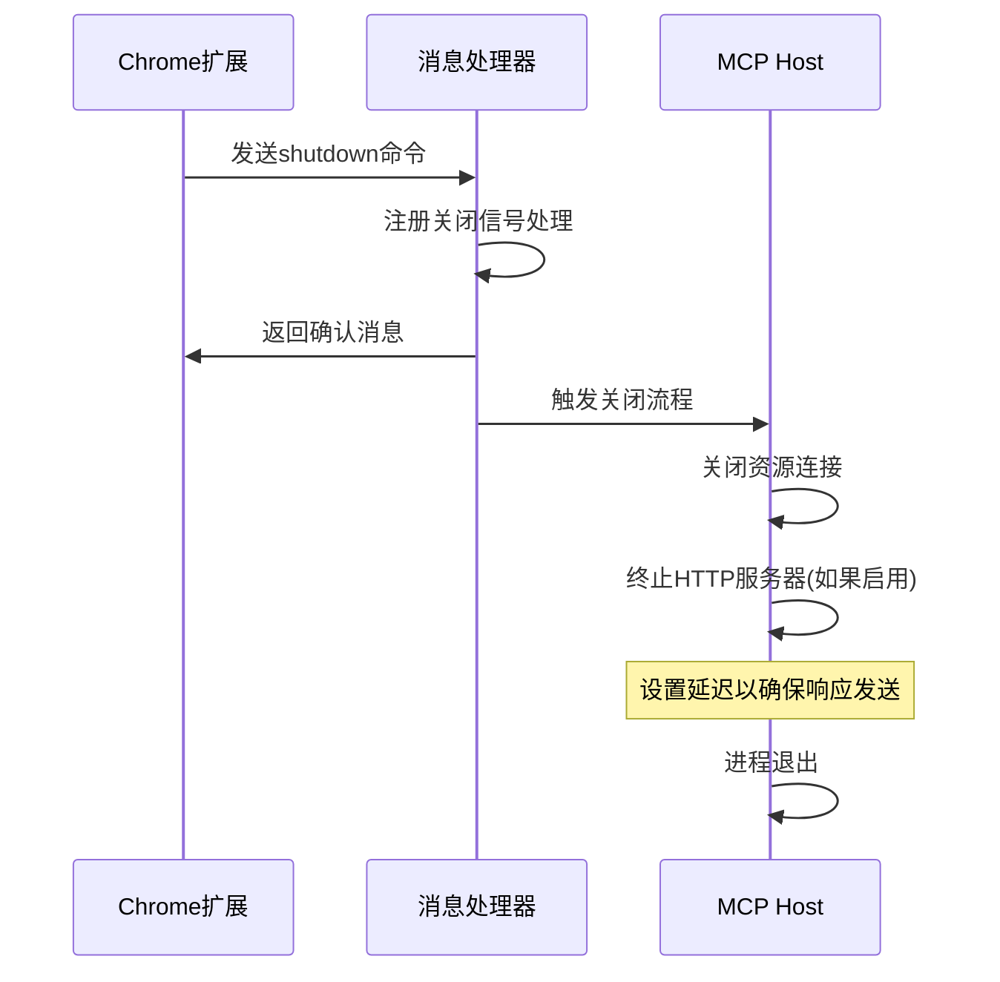
```mermaid
sequenceDiagram
    participant Ext as Chrome扩展
    participant MSG as 消息处理器
    participant MH as MCP Host
    
    Ext->>MSG: 发送shutdown命令
    MSG->>MSG: 注册关闭信号处理
    MSG->>Ext: 返回确认消息
    MSG->>MH: 触发关闭流程
    MH->>MH: 关闭资源连接
    MH->>MH: 终止HTTP服务器(如果启用)
    Note over MH: 设置延迟以确保响应发送
    MH->>MH: 进程退出
```

## 4. 通信协议

### 4.1 消息类型定义

| 消息类型 | 方向 | 参数 | 描述 |
|---------|------|------|------|
| `getStatus` | 扩展→Host | 无 | 请求当前MCP Host状态 |
| `status` | Host→扩展 | `data`对象 | 返回MCP Host状态信息 |
| `ping` | 扩展→Host | 无 | 心跳检测请求 |
| `ping_result` | Host→扩展 | `timestamp`时间戳 | 心跳检测响应 |
| `shutdown` | 扩展→Host | 无 | 请求MCP Host优雅关闭 |
| `error` | Host→扩展 | `error`错误信息 | 错误响应 |

### 4.2 消息格式详细说明

**扩展到MCP Host**:

```typescript
// 状态请求
{
  type: 'getStatus'
}

// 心跳检测
{
  type: 'ping'
}

// 关闭请求
{
  type: 'shutdown'
}
```

**MCP Host到扩展**:

```typescript
// 状态响应
{
  type: 'status',
  data: {
    isConnected: true,       // 连接状态
    startTime: 1630000000000,// 启动时间戳
    version: '0.1.0',        // 版本号
    runMode: 'stdio'         // 运行模式:stdio或http+stdio
  }
}

// 心跳响应
{
  type: 'ping_result',
  timestamp: 1630000010000   // 响应时间戳
}

// 错误响应
{
  type: 'error',
  error: '错误描述',         // 错误信息
  originalType: 'someType'   // 可选,引发错误的原始消息类型
}
```

## 5. 实现策略

### 5.1 状态管理详细设计

**状态数据模型**:

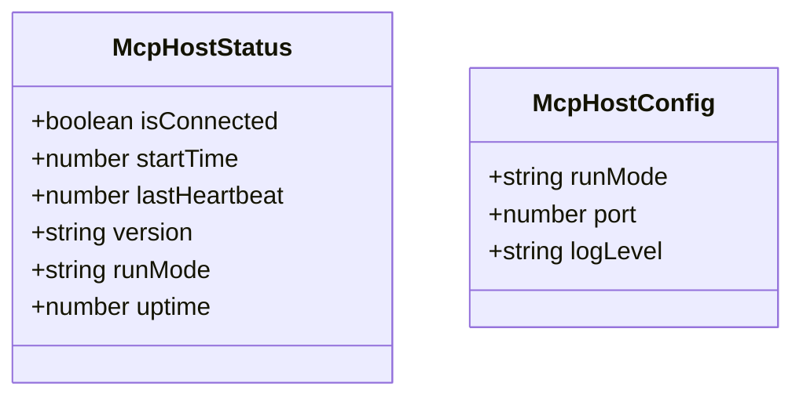
```mermaid
classDiagram
    class McpHostStatus {
        +boolean isConnected
        +number startTime
        +number lastHeartbeat
        +string version
        +string runMode
        +number uptime
    }
    
    class McpHostConfig {
        +string runMode
        +number port
        +string logLevel
    }
```

**状态监控流程**:

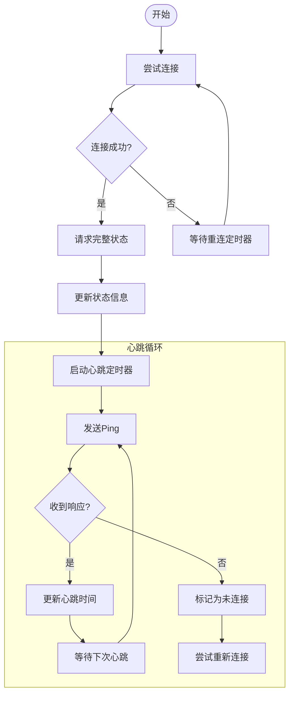
```mermaid
flowchart TD
    Start([开始]) --> Connect[尝试连接]
    
    Connect --> Connected{连接成功?}
    Connected -- 是 --> RequestStatus[请求完整状态]
    Connected -- 否 --> WaitReconnect[等待重连定时器]
    
    RequestStatus --> UpdateStatus[更新状态信息]
    UpdateStatus --> StartHeartbeat[启动心跳定时器]
    
    subgraph HeartbeatLoop[心跳循环]
        StartHeartbeat --> SendPing[发送Ping]
        SendPing --> PingResponse{收到响应?}
        PingResponse -- 是 --> UpdateHeartbeat[更新心跳时间]
        PingResponse -- 否 --> MarkDisconnected[标记为未连接]
        UpdateHeartbeat --> Wait[等待下次心跳]
        MarkDisconnected --> Reconnect[尝试重新连接]
        Wait --> SendPing
    end
    
    WaitReconnect --> Connect
```

### 5.2 启动/停止控制详细设计

**MCP Host启动流程**:

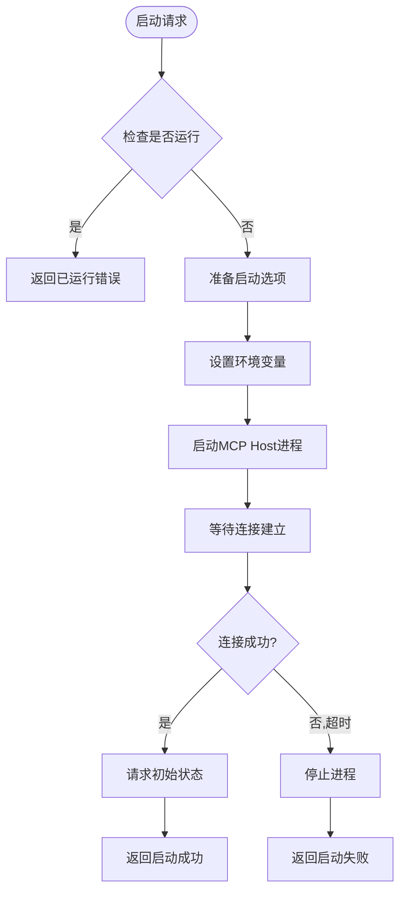
```mermaid
flowchart TD
    Start([启动请求]) --> CheckRunning{检查是否运行}
    
    CheckRunning -- 是 --> ReturnError[返回已运行错误]
    CheckRunning -- 否 --> PrepareOptions[准备启动选项]
    
    PrepareOptions --> SetEnvironment[设置环境变量]
    SetEnvironment --> StartProcess[启动MCP Host进程]
    
    StartProcess --> WaitConnect[等待连接建立]
    WaitConnect --> Connected{连接成功?}
    
    Connected -- 是 --> RequestStatus[请求初始状态]
    Connected -- 否,超时 --> StopProcess[停止进程]
    
    RequestStatus --> ReturnSuccess[返回启动成功]
    StopProcess --> ReturnFailure[返回启动失败]
```

**MCP Host停止流程**:

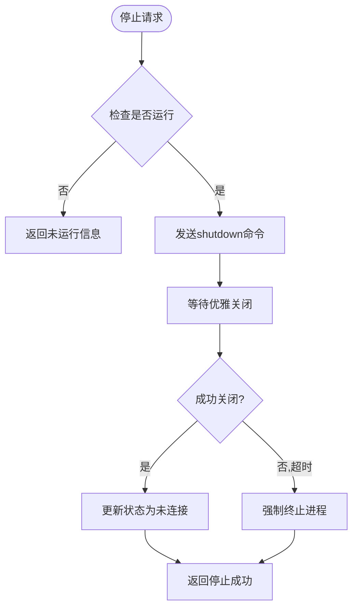
```mermaid
flowchart TD
    Start([停止请求]) --> CheckRunning{检查是否运行}
    
    CheckRunning -- 否 --> ReturnNotRunning[返回未运行信息]
    CheckRunning -- 是 --> SendShutdown[发送shutdown命令]
    
    SendShutdown --> WaitGraceful[等待优雅关闭]
    WaitGraceful --> Closed{成功关闭?}
    
    Closed -- 是 --> UpdateStatus[更新状态为未连接]
    Closed -- 否,超时 --> ForceTerminate[强制终止进程]
    
    UpdateStatus --> ReturnSuccess[返回停止成功]
    ForceTerminate --> ReturnSuccess
```

### 5.3 用户界面详细设计

**控制面板布局**:

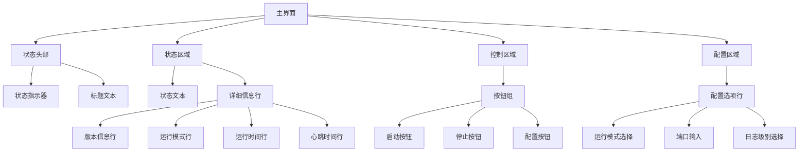
```mermaid
graph TD
    Main[主界面] --> Header[状态头部]
    Main --> StatusSection[状态区域]
    Main --> ControlSection[控制区域]
    Main --> ConfigSection[配置区域]
    
    Header --> StatusIndicator[状态指示器]
    Header --> TitleText[标题文本]
    
    StatusSection --> StatusText[状态文本]
    StatusSection --> DetailRows[详细信息行]
    
    DetailRows --> VersionRow[版本信息行]
    DetailRows --> ModeRow[运行模式行]
    DetailRows --> UptimeRow[运行时间行]
    DetailRows --> HeartbeatRow[心跳时间行]
    
    ControlSection --> ButtonGroup[按钮组]
    ButtonGroup --> StartButton[启动按钮]
    ButtonGroup --> StopButton[停止按钮]
    ButtonGroup --> ConfigButton[配置按钮]
    
    ConfigSection --> ConfigRows[配置选项行]
    ConfigRows --> RunModeRow[运行模式选择]
    ConfigRows --> PortRow[端口输入]
    ConfigRows --> LogLevelRow[日志级别选择]
```

**UI状态转换**:

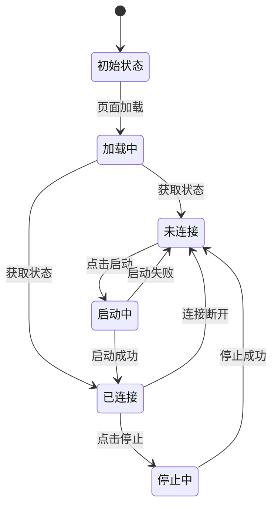
```mermaid
stateDiagram-v2
    [*] --> 初始状态
    初始状态 --> 加载中: 页面加载
    加载中 --> 未连接: 获取状态
    加载中 --> 已连接: 获取状态
    
    未连接 --> 启动中: 点击启动
    启动中 --> 已连接: 启动成功
    启动中 --> 未连接: 启动失败
    
    已连接 --> 停止中: 点击停止
    停止中 --> 未连接: 停止成功
    
    已连接 --> 未连接: 连接断开
```

**UI组件状态表**:

| 组件 | 未连接状态 | 已连接状态 | 启动中状态 | 停止中状态 |
|------|-----------|------------|-----------|------------|
| 状态指示器 | 红色 | 绿色 | 黄色 | 黄色 |
| 状态文本 | "未连接" | "已连接" | "正在启动..." | "正在停止..." |
| 详细信息区域 | 隐藏 | 显示 | 隐藏 | 显示 |
| 启动按钮 | 启用 | 禁用 | 禁用 | 禁用 |
| 停止按钮 | 禁用 | 启用 | 禁用 | 禁用 |
| 配置区域 | 可见(如已展开) | 可见(如已展开) | 隐藏 | 隐藏 |

## 6. 错误处理策略

**错误类型分类**:

| 错误类型 | 描述 | 处理策略 |
|---------|------|---------|
| 连接错误 | 无法建立与MCP Host的连接 | 显示错误状态,定时重试连接 |
| 启动错误 | MCP Host启动失败 | 显示错误消息,允许用户修改配置后重试 |
| 通信错误 | 消息发送/接收失败 | 标记连接断开,尝试重新连接 |
| 心跳超时 | 未收到心跳响应 | 标记连接断开,尝试重新连接 |
| 停止错误 | MCP Host无法正常停止 | 尝试强制终止,显示警告消息 |

**错误处理流程**:

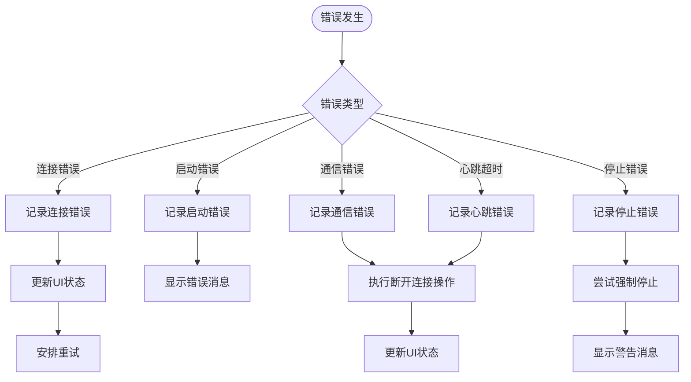
```mermaid
flowchart TD
    Error([错误发生]) --> Classify{错误类型}
    
    Classify -- 连接错误 --> LogConnect[记录连接错误]
    LogConnect --> UpdateUIConnect[更新UI状态]
    UpdateUIConnect --> ScheduleRetry[安排重试]
    
    Classify -- 启动错误 --> LogStart[记录启动错误]
    LogStart --> ShowStartError[显示错误消息]
    
    Classify -- 通信错误 --> LogComm[记录通信错误]
    LogComm --> DisconnectAction[执行断开连接操作]
    DisconnectAction --> UpdateUIDisconnect[更新UI状态]
    
    Classify -- 心跳超时 --> LogHeartbeat[记录心跳错误]
    LogHeartbeat --> DisconnectAction
    
    Classify -- 停止错误 --> LogStop[记录停止错误]
    LogStop --> ForceStop[尝试强制停止]
    ForceStop --> ShowWarning[显示警告消息]
```

**错误恢复策略**:

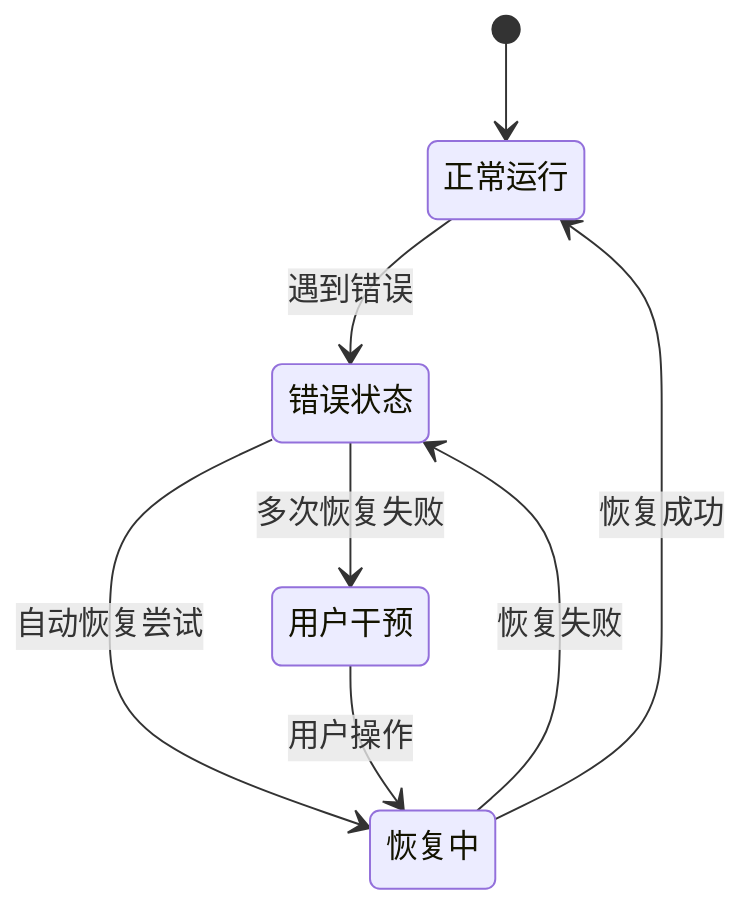
```mermaid
stateDiagram-v2
    [*] --> 正常运行
    正常运行 --> 错误状态: 遇到错误
    错误状态 --> 恢复中: 自动恢复尝试
    恢复中 --> 正常运行: 恢复成功
    恢复中 --> 错误状态: 恢复失败
    错误状态 --> 用户干预: 多次恢复失败
    用户干预 --> 恢复中: 用户操作
```

## 7. 安全考虑

**通信安全模型**:

```mermaid
flowchart TD
    subgraph Chrome浏览器
        Extension[Chrome扩展]
    end
    
    subgraph 本地系统
        MCP[MCP Host]
    end
    
    Extension <-->|Native Messaging| MCP
    
    ChromeStore[Chrome Web Store] -->|签名验证| Extension
    Manifest[manifest.json] -->|allowed_origins| MCP
    
    subgraph 安全层
        ChromeStore
        Manifest
        ValidateInput[输入验证]
        AccessControl[访问控制]
    end
    
    Extension -->|消息| ValidateInput
    ValidateInput -->|验证后| MCP
    MCP --> AccessControl
    AccessControl -->|授权| Extension
```

**权限控制矩阵**:

| 操作 | 扩展→Host | Host→扩展 |
|------|-----------|------------|
| 读取状态 | 允许 | 允许(响应) |
| 发送心跳 | 允许 | 允许(响应) |
| 关闭Host | 允许 | - |
| 启动Host | 允许(通过Chrome API) | - |
| 修改配置 | 允许(仅启动参数) | - |

## 8. 代码组织与结构

### 8.1 项目结构概览

```mermaid
graph TD
    Root[项目根目录] --> ChromeExt[chrome-extension/]
    Root --> McpHost[mcp-host/]
    Root --> Packages[packages/]
    Root --> Pages[pages/]
    Root --> Docs[docs/]
    
    ChromeExt --> ExtSrc[src/]
    ChromeExt --> ExtPublic[public/]
    ChromeExt --> ExtUtils[utils/]
    
    ExtSrc --> Background[background/]
    Background --> BGIndex[index.ts]
    Background --> BGLog[log.ts]
    Background --> BGUtils[utils.ts]
    Background --> MCP[mcp/]
    
    MCP --> HostManager[host-manager.ts]
    
    McpHost --> MHSrc[src/]
    McpHost --> MHTests[tests/]
    
    MHSrc --> MHIndex[index.ts]
    MHSrc --> MHMessaging[messaging.ts]
    MHSrc --> MHResources[browser-resources.ts]
    MHSrc --> MHTools[browser-tools.ts]
    
    Pages --> Content[content/]
    Pages --> Options[options/]
    Pages --> SidePanel[side-panel/]
    Pages --> Popup[popup/]
    
    Popup --> MCPControl[mcp-control/]
```

### 8.2 主要组件代码分布

| 组件 | 位置 | 职责 |
|------|------|------|
| MCP Host 程序 | `mcp-host/src/` | 实现Native Messaging Host服务端 |
| Background Script | `chrome-extension/src/background/` | 扩展后台脚本，管理与MCP Host通信 |
| MCP Host Manager | `chrome-extension/src/background/mcp/host-manager.ts` | 管理MCP Host的连接、状态和控制 |
| Popup UI | `pages/popup/mcp-control/` | MCP Host状态展示和控制界面 |
| 选项页 | `pages/options/` | 扩展选项配置页面 |
| 侧边栏 | `pages/side-panel/` | 扩展侧边栏功能 |
| 内容脚本 | `pages/content/` | 页面内容脚本，与网页交互 |

### 8.3 MCP Host 控制实现场景

以下是MCP Host状态监控与控制功能的代码组织场景：

#### 8.3.1 MCP Host Manager实现

MCP Host Manager是管理MCP Host状态和控制的核心组件，位于`chrome-extension/src/background/mcp/host-manager.ts`：

```mermaid
classDiagram
    class McpHostManager {
        -port: chrome.runtime.Port
        -status: McpHostStatus
        -listeners: StatusListener[]
        +getStatus(): McpHostStatus
        +connect(): boolean
        +startMcpHost(options): Promise
        +stopMcpHost(): Promise
        +addStatusListener(listener): void
        +removeStatusListener(listener): void
        -handleMessage(message): void
        -startHeartbeat(): void
    }
```

#### 8.3.2 Background Script集成

在`chrome-extension/src/background/index.ts`中集成MCP Host Manager，处理来自Popup和Options页面的消息：

```mermaid
sequenceDiagram
    participant BG as background/index.ts
    participant HM as mcp/host-manager.ts
    participant UI as popup/mcp-control
    
    BG->>HM: 创建McpHostManager实例
    UI->>BG: 发送消息(type: 'getMcpHostStatus')
    BG->>HM: getStatus()
    HM->>BG: 返回状态
    BG->>UI: 发送响应(状态信息)
    
    UI->>BG: 发送消息(type: 'startMcpHost', options)
    BG->>HM: startMcpHost(options)
    HM->>BG: 返回结果
    BG->>UI: 发送响应(成功/失败)
```

#### 8.3.3 Popup UI实现

Popup UI实现在`pages/popup/mcp-control/`目录中：

- `index.html` - 弹出窗口HTML结构
- `index.js` - 交互逻辑和状态管理

```mermaid
classDiagram
    class PopupController {
        -elements: DOMReferences
        -status: McpHostStatus
        -config: McpHostConfig
        +initialize(): void
        +updateUI(status): void
        +handleStartClick(): void
        +handleStopClick(): void
        +toggleConfigSection(): void
        +saveConfig(): void
        +loadConfig(): void
    }
```

#### 8.3.4 Pages目录的作用

`pages`目录包含扩展不同页面相关的代码，每个子目录代表一个独立的页面或功能模块：

1. **content**: 包含内容脚本(Content Scripts)，是注入到用户访问网页中的JavaScript脚本，可以读取和修改网页DOM。在MCP Host控制功能中主要用于：
   - 与页面内容交互
   - 执行DOM操作
   - 支持浏览器资源访问

2. **options**: 包含扩展的选项页面，用户可以在这里配置扩展行为。对于MCP Host控制功能，可以用于：
   - 高级MCP Host配置设置
   - 默认参数配置
   - 日志级别控制

3. **side-panel**: 包含扩展的侧边栏界面，提供更丰富的UI交互。在MCP Host控制中可用于：
   - 更详细的MCP Host状态监控
   - MCP资源和工具配置界面
   - 实时日志查看

每个页面目录的结构类似：
```
pages/[page-type]/
├── index.html       # 页面HTML入口
├── package.json     # 页面依赖
├── tsconfig.json    # TypeScript配置
├── vite.config.mts  # Vite构建配置
├── public/          # 静态资源
└── src/             # 页面源代码
```

#### 8.3.5 消息通信流

```mermaid
graph TD
    Popup[Popup UI] -->|chrome.runtime.sendMessage| Background[Background Script]
    Options[Options Page] -->|chrome.runtime.sendMessage| Background
    SidePanel[Side Panel] -->|chrome.runtime.sendMessage| Background
    Background -->|chrome.runtime.connectNative| MCPHost[MCP Host]
    Background -->|sendResponse| Popup
    Background -->|sendResponse| Options
    Background -->|sendResponse| SidePanel
    MCPHost -->|stdin/stdout| Background
```

### 8.4 构建与打包流程

```mermaid
flowchart TD
    Source[源代码] --> Build[构建过程]
    
    subgraph Build
        Compile[TypeScript编译] --> Bundle[Vite打包]
        Bundle --> Manifest[生成manifest.json]
    end
    
    Build --> Output[扩展输出目录]
    Output --> Load[加载至Chrome]
    
    subgraph Components
        BG[Background Scripts]
        PopupUI[Popup UI]
        Pages[Pages]
        CS[Content Scripts]
    end
    
    BG --> Compile
    PopupUI --> Compile
    Pages --> Compile
    CS --> Compile
```

## 9. 后续规划

**功能拓展路线图**:

```mermaid
gantt
    title MCP Host控制功能路线图
    dateFormat  YYYY-MM-DD
    section 第一阶段
    基础状态监控和控制功能   :done, 2024-07-01, 30d
    section 第二阶段
    MCP资源和工具配置界面   :active, 2024-08-01, 45d
    section 第三阶段
    日志查看器功能         :2024-09-15, 30d
    section 第四阶段
    资源监控功能增强       :2024-10-15, 30d
    section 第五阶段
    多MCP Host实例管理     :2024-11-15, 45d
```

**功能依赖关系**:

```mermaid
graph TD
    Base[基础状态监控和控制] --> Config[资源和工具配置]
    Base --> Logger[日志查看器]
    Config --> MultiHost[多Host实例管理]
    Logger --> ResourceMon[资源监控增强]
    ResourceMon --> MultiHost
```
