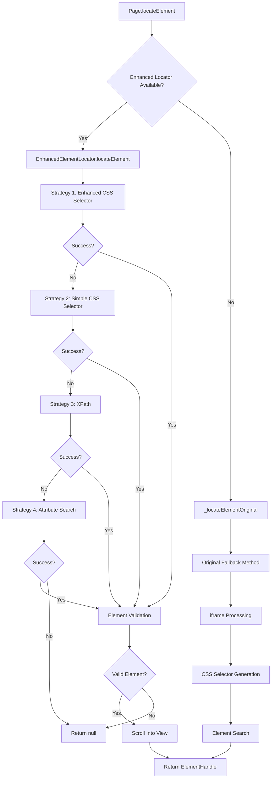
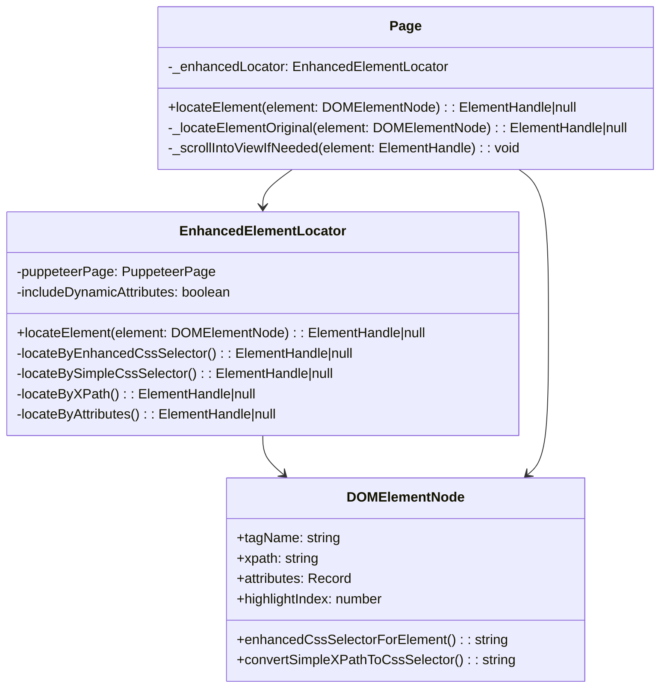
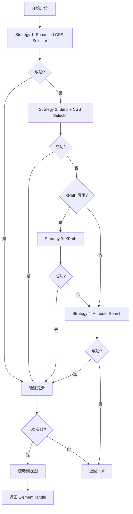
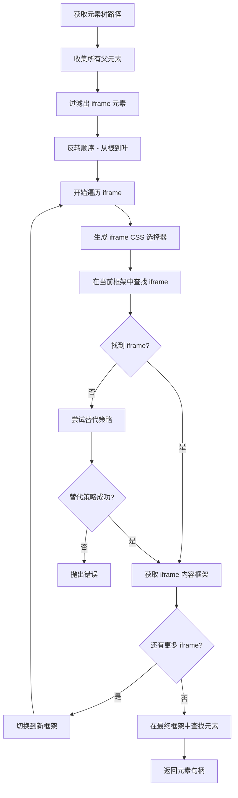
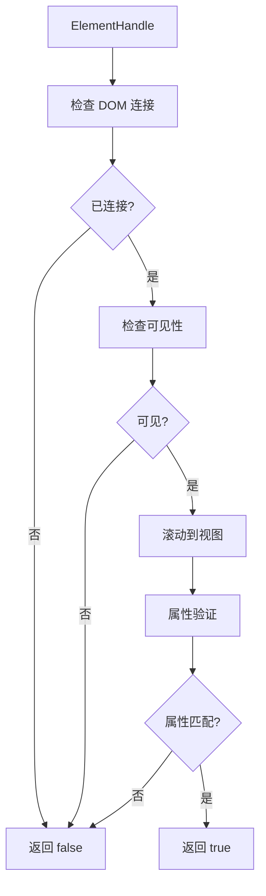
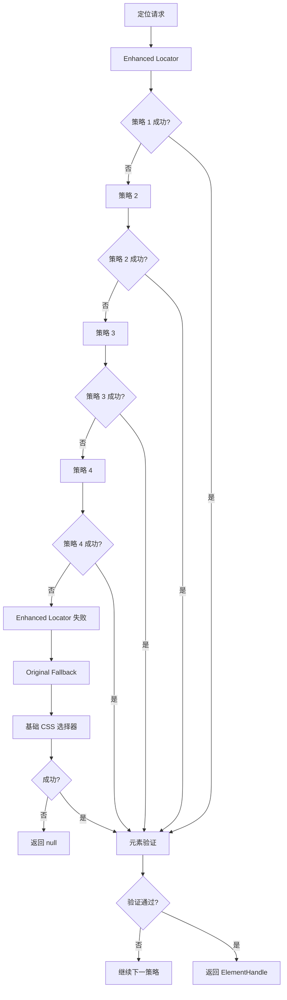

# Page.locateElement 实现原理分析

## 概述

`page.locateElement` 是 algonius-browser 项目中负责元素定位的核心方法，它通过多重策略确保在复杂的 Web 环境中能够可靠地定位 DOM 元素。本文档详细分析其实现原理、技术架构和定位策略。

## 整体架构

### 架构流程图



### 核心组件关系



## 核心组件详解

### 1. Page.locateElement 主入口

```typescript
async locateElement(element: DOMElementNode): Promise<ElementHandle | null> {
  if (!this._puppeteerPage) {
    logger.warning('Puppeteer is not connected');
    return null;
  }

  // 优先使用增强定位器
  if (this._enhancedLocator) {
    try {
      const result = await this._enhancedLocator.locateElement(element);
      if (result) {
        logger.debug('Element located using enhanced locator');
        return result;
      }
      logger.debug('Enhanced locator failed, falling back to original method');
    } catch (error) {
      logger.debug('Enhanced locator error, falling back to original method:', error);
    }
  }

  // 降级到原始方法
  return this._locateElementOriginal(element);
}
```

**关键特点：**
- **双重保障**：Enhanced Locator + Original Fallback
- **错误容忍**：任何一层失败都有备用方案
- **调试友好**：详细的日志记录

### 2. EnhancedElementLocator 四重策略

#### 策略决策流程



#### Strategy 1: Enhanced CSS Selector

**目标**：使用最完整的元素信息构建精确选择器

```typescript
private async locateByEnhancedCssSelector(element: DOMElementNode): Promise<ElementHandle | null> {
  let currentFrame: PuppeteerPage | Frame = this.puppeteerPage;

  // 1. iframe 链式处理
  const parents: DOMElementNode[] = [];
  let current = element;
  while (current.parent) {
    parents.push(current.parent);
    current = current.parent;
  }

  // 2. 逐层处理 iframe
  const iframes = parents.reverse().filter(item => item.tagName === 'iframe');
  for (const parent of iframes) {
    // iframe 定位和内容访问
  }

  // 3. 生成增强 CSS 选择器
  const cssSelector = this.generateSafeCssSelector(element);
  
  // 4. 元素搜索和验证
  const elementHandle = await currentFrame.$(cssSelector);
  if (elementHandle) {
    const isValid = await this.validateAndPrepareElement(elementHandle);
    if (isValid) {
      return elementHandle;
    }
  }

  return null;
}
```

**技术细节：**
- **iframe 递归处理**：处理复杂嵌套结构
- **CSS 转义**：安全处理特殊字符
- **属性过滤**：只使用稳定、安全的属性

#### Strategy 2: Simple CSS Selector

**目标**：使用最稳定的标识符进行定位

```typescript
private async locateBySimpleCssSelector(element: DOMElementNode): Promise<ElementHandle | null> {
  const tagName = element.tagName || '*';
  const selectors = [];

  // 优先级排序的简单选择器
  if (element.attributes.id) {
    selectors.push(`${tagName}#${CSS.escape(element.attributes.id)}`);
  }

  if (element.attributes['data-testid']) {
    selectors.push(`${tagName}[data-testid="${CSS.escape(element.attributes['data-testid'])}"]`);
  }

  if (element.attributes.name && ['input', 'select', 'textarea', 'button'].includes(tagName.toLowerCase())) {
    selectors.push(`${tagName}[name="${CSS.escape(element.attributes.name)}"]`);
  }

  // 逐个尝试选择器
  for (const selector of selectors) {
    const elementHandle = await this.puppeteerPage.$(selector);
    if (elementHandle && await this.validateAndPrepareElement(elementHandle)) {
      // 额外验证：属性匹配
      const matches = await this.verifyElementAttributes(elementHandle, element);
      if (matches) {
        return elementHandle;
      }
    }
  }

  return null;
}
```

**优势：**
- **高精度**：使用最唯一的标识符
- **快速**：直接定位，无需复杂遍历
- **稳定**：不依赖动态生成的属性

#### Strategy 3: XPath

**目标**：使用 XPath 进行精确路径定位

```typescript
private async locateByXPath(element: DOMElementNode): Promise<ElementHandle | null> {
  if (!element.xpath) return null;

  const xpath = element.xpath.startsWith('/') ? element.xpath : `/${element.xpath}`;
  
  // 使用 document.evaluate 进行 XPath 搜索
  const elementHandle = await this.puppeteerPage.evaluateHandle((xpath) => {
    const result = document.evaluate(xpath, document, null, XPathResult.FIRST_ORDERED_NODE_TYPE, null);
    return result.singleNodeValue;
  }, xpath);
  
  if (elementHandle) {
    const isValid = await this.validateAndPrepareElement(elementHandle as ElementHandle);
    if (isValid) {
      return elementHandle as ElementHandle;
    }
  }

  return null;
}
```

#### Strategy 4: Attribute Search

**目标**：基于稳定属性的最后防线

```typescript
private async locateByAttributes(element: DOMElementNode): Promise<ElementHandle | null> {
  const tagName = element.tagName || '*';
  const attributeSelectors = [];
  
  // 稳定属性优先级
  const stableAttributes = ['data-testid', 'data-qa', 'id', 'name', 'aria-label', 'role'];
  
  for (const attr of stableAttributes) {
    if (element.attributes[attr]) {
      attributeSelectors.push(`${tagName}[${attr}="${CSS.escape(element.attributes[attr])}"]`);
    }
  }

  for (const selector of attributeSelectors) {
    const elementHandle = await this.puppeteerPage.$(selector);
    if (elementHandle && await this.validateAndPrepareElement(elementHandle)) {
      return elementHandle;
    }
  }

  return null;
}
```

## CSS 选择器生成机制

### XPath 到 CSS 转换算法

```mermaid
flowchart TD
    A[XPath Input] --> B[清理路径]
    B --> C[分割路径段]
    C --> D[遍历每个段]
    
    D --> E{包含索引 [n]?}
    E -->|是| F[提取基础部分]
    E -->|否| G[直接处理]
    
    F --> H[转换为 :nth-of-type]
    G --> I[处理冒号转义]
    H --> I
    
    I --> J[组合 CSS 部分]
    J --> K[添加类选择器]
    K --> L[添加属性选择器]
    L --> M[返回完整选择器]
```

### 核心转换代码

```typescript
private convertXPathToCssSafely(xpath: string): string {
  const cleanXpath = xpath.replace(/^\//, '');
  const parts = cleanXpath.split('/');
  const cssParts: string[] = [];

  for (const part of parts) {
    if (!part) continue;

    // 处理索引元素 [n]
    if (part.includes('[') && part.includes(']')) {
      const bracketIndex = part.indexOf('[');
      let basePart = part.substring(0, bracketIndex);
      const indexPart = part.substring(bracketIndex);

      // 转义冒号（自定义元素）
      if (basePart.includes(':')) {
        basePart = basePart.replace(/:/g, '\\:');
      }

      // 处理数字索引
      const indexMatch = indexPart.match(/\[(\d+)\]/);
      if (indexMatch) {
        const index = parseInt(indexMatch[1], 10);
        basePart += `:nth-of-type(${index})`;
      }

      cssParts.push(basePart);
    } else {
      // 普通元素名处理
      const safePart = part.includes(':') ? part.replace(/:/g, '\\:') : part;
      cssParts.push(safePart);
    }
  }

  return cssParts.join(' > ');
}
```

### 属性处理策略

```typescript
enhancedCssSelectorForElement(includeDynamicAttributes = true): string {
  let cssSelector = this.convertSimpleXPathToCssSelector(this.xpath);

  // 1. 类属性处理
  const classValue = this.attributes.class;
  if (classValue && includeDynamicAttributes) {
    const validClassNamePattern = /^[a-zA-Z_][a-zA-Z0-9_-]*$/;
    const classes = classValue.trim().split(/\s+/);
    for (const className of classes) {
      if (className.trim() && validClassNamePattern.test(className)) {
        cssSelector += `.${CSS.escape(className)}`;
      }
    }
  }

  // 2. 安全属性集合
  const SAFE_ATTRIBUTES = new Set([
    'id', 'name', 'type', 'placeholder',
    'aria-label', 'aria-labelledby', 'aria-describedby', 'role',
    'for', 'autocomplete', 'required', 'readonly',
    'alt', 'title', 'src', 'href', 'target'
  ]);

  if (includeDynamicAttributes) {
    SAFE_ATTRIBUTES.add('data-id');
    SAFE_ATTRIBUTES.add('data-qa');
    SAFE_ATTRIBUTES.add('data-cy');
    SAFE_ATTRIBUTES.add('data-testid');
  }

  // 3. 属性选择器生成
  for (const [attribute, value] of Object.entries(this.attributes)) {
    if (attribute === 'class' || !SAFE_ATTRIBUTES.has(attribute)) continue;

    const safeAttribute = attribute.replace(':', '\\:');
    
    if (value === '') {
      cssSelector += `[${safeAttribute}]`;
    } else if (/["'<>`\n\r\t]/.test(value)) {
      const collapsedValue = value.replace(/\s+/g, ' ').trim();
      const safeValue = collapsedValue.replace(/"/g, '\\"');
      cssSelector += `[${safeAttribute}*="${safeValue}"]`;
    } else {
      cssSelector += `[${safeAttribute}="${value}"]`;
    }
  }

  return cssSelector;
}
```

## iframe 处理机制

### iframe 链式处理流程



### iframe 替代定位策略

```typescript
private async findIframeAlternative(
  currentFrame: PuppeteerPage | Frame, 
  iframeElement: DOMElementNode
): Promise<ElementHandle | null> {
  // 获取页面所有 iframe
  const iframes = await currentFrame.$$('iframe');
  
  // 如果只有一个 iframe，直接使用
  if (iframes.length === 1) {
    return iframes[0];
  }

  // 通过属性匹配查找
  for (const iframe of iframes) {
    const src = await iframe.evaluate(el => el.getAttribute('src'));
    const name = await iframe.evaluate(el => el.getAttribute('name'));
    const id = await iframe.evaluate(el => el.getAttribute('id'));

    if (
      (iframeElement.attributes.src && src === iframeElement.attributes.src) ||
      (iframeElement.attributes.name && name === iframeElement.attributes.name) ||
      (iframeElement.attributes.id && id === iframeElement.attributes.id)
    ) {
      return iframe;
    }
  }

  return null;
}
```

## 元素验证与准备

### 验证流程



### 核心验证代码

```typescript
private async validateAndPrepareElement(elementHandle: ElementHandle): Promise<boolean> {
  try {
    // 1. DOM 连接性检查
    const isConnected = await elementHandle.evaluate(el => el.isConnected);
    if (!isConnected) {
      logger.debug('Element is not connected to DOM');
      return false;
    }

    // 2. 可见性检查
    const isVisible = await elementHandle.evaluate(el => {
      const rect = el.getBoundingClientRect();
      const style = window.getComputedStyle(el);
      return rect.width > 0 && rect.height > 0 && 
             style.visibility !== 'hidden' && 
             style.display !== 'none';
    });

    if (!isVisible) {
      logger.debug('Element is not visible');
      return false;
    }

    // 3. 滚动到视图
    await elementHandle.evaluate(el => {
      el.scrollIntoView({
        behavior: 'instant',
        block: 'center',
        inline: 'center',
      });
    });

    return true;
  } catch (error) {
    logger.debug('Element validation failed:', error);
    return false;
  }
}
```

### 属性验证

```typescript
private async verifyElementAttributes(elementHandle: ElementHandle, expectedElement: DOMElementNode): Promise<boolean> {
  const elementInfo = await elementHandle.evaluate(el => {
    const tagName = el.tagName.toLowerCase();
    const attributes: Record<string, string> = {};
    
    for (let i = 0; i < el.attributes.length; i++) {
      const attr = el.attributes[i];
      attributes[attr.name] = attr.value;
    }
    
    return { tagName, attributes };
  });

  // 标签名验证
  if (expectedElement.tagName && elementInfo.tagName !== expectedElement.tagName.toLowerCase()) {
    return false;
  }

  // 关键属性验证
  const keyAttributes = ['id', 'name', 'type', 'data-testid'];
  for (const attr of keyAttributes) {
    const expectedValue = expectedElement.attributes[attr];
    const actualValue = elementInfo.attributes[attr];
    
    if (expectedValue && actualValue !== expectedValue) {
      return false;
    }
  }

  return true;
}
```

## 错误处理与降级策略

### 错误处理层次



### 日志与调试

系统提供详细的调试信息：

```typescript
logger.debug('Attempting to locate element:', {
  tagName: element.tagName,
  highlightIndex: element.highlightIndex,
  xpath: element.xpath,
  attributes: element.attributes
});

// 每个策略的成功/失败都有对应日志
logger.debug('Element located using enhanced CSS selector');
logger.debug('Enhanced CSS selector failed:', error);
logger.debug('Element located using simple CSS selector');
// ...
```

## 性能考虑

### 策略优先级设计

1. **Enhanced CSS Selector**: 最全面但最重的选择器
2. **Simple CSS Selector**: 平衡性能和准确性
3. **XPath**: 备用精确定位
4. **Attribute Search**: 最轻量的最后选择

### 缓存机制

- **选择器缓存**: 避免重复生成相同选择器
- **元素验证缓存**: 减少重复的 DOM 查询
- **框架引用缓存**: 避免重复的 iframe 导航

## 已知限制与改进方向

### 当前限制

1. **动态 ID 处理**: GitHub 等网站使用动态生成的 ID（如 `:ru:`, `:r31:`）
2. **反自动化机制**: 某些网站会检测并阻止自动化操作
3. **复杂 SPA**: 单页应用的动态内容更新可能导致元素失效
4. **性能开销**: 四重策略在某些情况下可能产生不必要的开销

### 改进方向

1. **智能元素等待**: 实现更好的元素稳定性检测
2. **机器学习辅助**: 基于历史成功率优化策略选择
3. **视觉定位**: 结合图像识别进行元素定位
4. **预测性缓存**: 预先计算和缓存可能需要的选择器

## 结论

`page.locateElement` 通过多层次的策略设计，提供了一个强大而可靠的元素定位系统。其渐进式降级、详细的错误处理和全面的验证机制，使得它能够在各种复杂的 Web 环境中工作。

虽然仍然存在一些限制，特别是在处理高度动态的现代 Web 应用时，但其架构为未来的改进提供了良好的基础。通过持续的优化和新策略的引入，这个系统将能够更好地应对不断发展的 Web 技术挑战。
