# System Patterns: Algonius Browser

## System Architecture

Algonius Browser follows a Chrome extension architecture with a multi-agent system design and MCP integration. The core architecture includes:

### 1. Extension Structure
- **Background Script**: Manages the core extension functionality and agent system
- **Content Scripts**: Interact with web pages for DOM manipulation and extraction
- **Side Panel**: Provides the user interface for interacting with the agent system
- **Options Page**: Allows configuration of LLM providers and agent models
- **Native Messaging Host**: Provides MCP services to external AI systems

### 2. Multi-Agent System
The extension employs a collaborative multi-agent architecture:

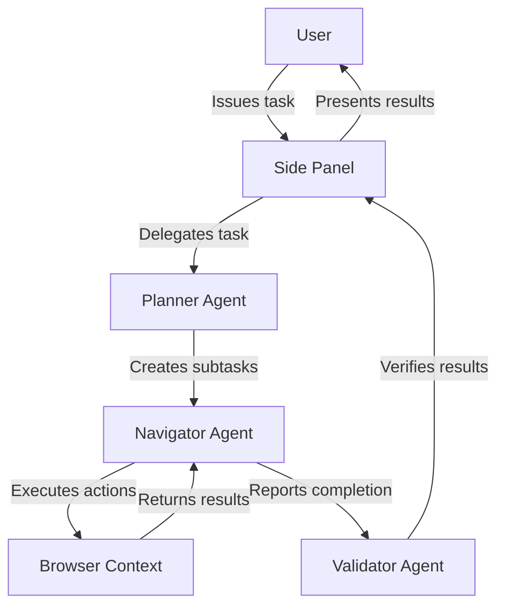

- **Planner Agent**: Responsible for task decomposition and strategy development
- **Navigator Agent**: Executes browser interactions and interprets web content
- **Validator Agent**: Verifies task completion and result accuracy

### 3. MCP Integration System
The current SSE-based MCP architecture:

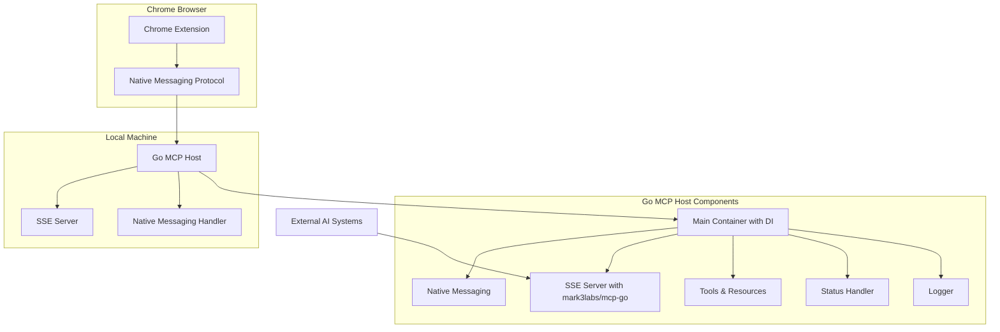

- **Chrome Extension**: Captures browser state and executes operations
- **Native Messaging Protocol**: Bidirectional communication channel between extension and host
- **Go MCP Host**: Single application managing both Native Messaging and SSE server
- **SSE Server**: HTTP/SSE endpoint using mark3labs/mcp-go for external AI systems
- **Dependency Injection Container**: Clean architecture with explicit dependencies
- **External AI Systems**: Access browser capabilities via standard MCP over HTTP/SSE

### 4. RPC Handler Pattern
The project uses a consistent pattern for implementing RPC handlers that expose browser functionality through the MCP interface:

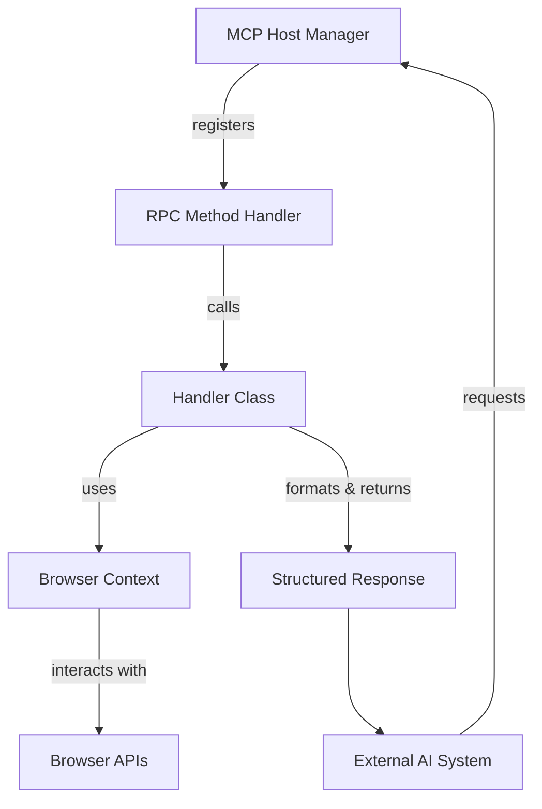

- **Handler Class Structure**: Each RPC method is implemented as a class with clear responsibility
- **Dependency Injection**: Dependencies like BrowserContext are injected through constructors
- **Method Binding**: Handler methods are bound to their instances during registration
- **Standardized Error Handling**: Consistent error codes and message formats
- **Data Formatting**: Human-readable and structured data representations
- **Layered Architecture**: Clear separation between RPC interface, handler logic, and browser interaction

This pattern enables consistent implementation of browser capabilities as RPC methods, making them accessible through the MCP protocol while maintaining clean separation of concerns.

### 5. Communication Flow
- **User → Extension**: Via the side panel interface
- **Between Agents**: Through structured message passing
- **Extension → Web Page**: Via content scripts and browser APIs
- **Agent → LLM**: Through configured provider APIs
- **Extension → Native Host**: Via Chrome Native Messaging protocol
- **External AI → Browser**: Via MCP resources and tools

## Key Technical Decisions

### 1. Multi-Package Monorepo Structure
Algonius Browser uses a monorepo approach with pnpm workspaces, separating functionality into distinct packages:

- **Chrome Extension**: The main extension implementation
- **UI Package**: Shared UI components
- **Storage Package**: Data persistence mechanisms
- **I18n Package**: Internationalization support
- **HMR Package**: Hot module replacement for development
- **Schema Utils**: Schema validation utilities
- **Dev Utils**: Development utilities

This structure enables better code organization, reuse, and targeted testing.

### 2. Browser Extension Framework
Leveraging Vite for modern bundling and Chrome Extension API for browser integration, providing:

- Fast HMR during development
- Efficient bundling for production
- Access to browser APIs for automation

### 3. Agent System Design
- **Prompt Engineering**: Specialized prompts for different agent roles
- **Context Management**: Maintaining and passing relevant context between agents
- **Task Decomposition**: Breaking complex tasks into manageable steps

### 4. LLM Provider Integration
- **Provider Abstraction**: Consistent interface across different LLM providers
- **Model Selection**: Flexible assignment of models to different agents
- **Efficient Prompting**: Minimizing token usage while maximizing effectiveness

## Design Patterns in Use

### 1. Observer Pattern
Used for event handling and updates between different parts of the extension:
- Background script observes tab changes and browser events
- UI components observe state changes for rendering updates

### 2. Factory Pattern
Implemented for creating agent instances with appropriate configuration:
- Agent factory creates agents with specific roles
- Provider factory creates appropriate LLM provider connectors

### 3. Strategy Pattern
Applied to allow interchangeable algorithms:
- Different navigation strategies based on website structure
- Alternative validation approaches based on task type

### 4. Command Pattern
Used for encapsulating browser automation actions:
- Click commands
- Scroll commands
- Form input commands
- Navigation commands

### 5. Adapter Pattern
Implemented for LLM provider integration:
- Unified interface for different LLM APIs
- Translation between provider-specific responses and internal formats

### 6. Test Compatibility Pattern
Applied to testing framework migration:
- Compatibility layer between Jest and Vitest APIs
- Single process execution for specific integration tests
- Strategic test skipping with documentation for challenging tests

### 7. RPC Handler Pattern
Implemented for MCP interface to browser functionality:

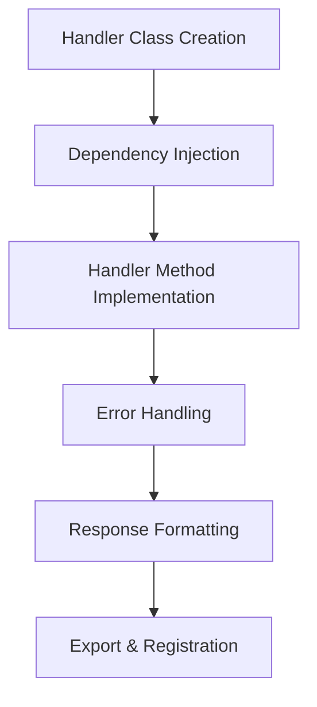

Key aspects of the RPC handler pattern include:
- **Class-Based Structure**: Each handler is a class with a clear responsibility
- **Constructor Dependency Injection**: Dependencies like BrowserContext are injected
- **Handler Method Implementation**: Following the RpcHandler interface
- **Standardized Error Handling**: Consistent error codes and formats
- **Response Formatting**: Structuring data for both human and machine consumption
- **Export and Registration**: Centralized export and binding during registration

## Component Relationships

### 1. Extension Components

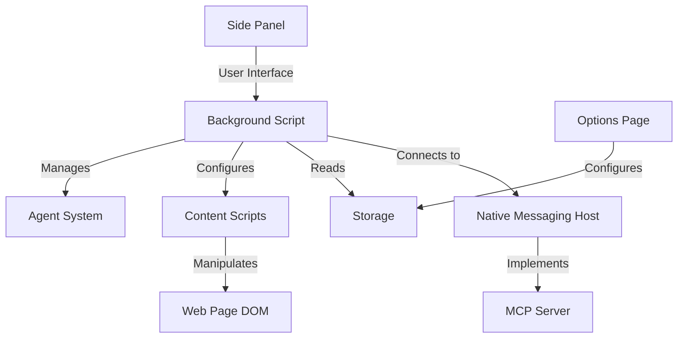

### 2. MCP Components

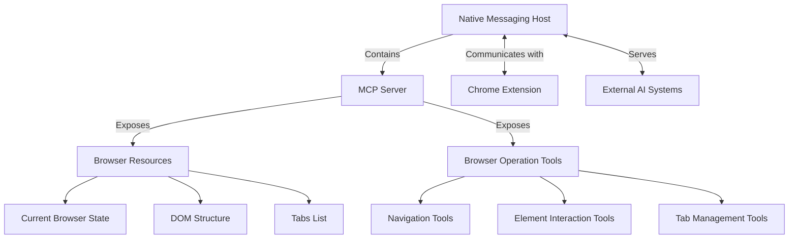

### 3. Package Dependencies

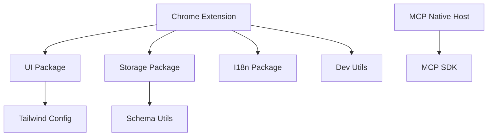

### 3. Agent Interaction Model

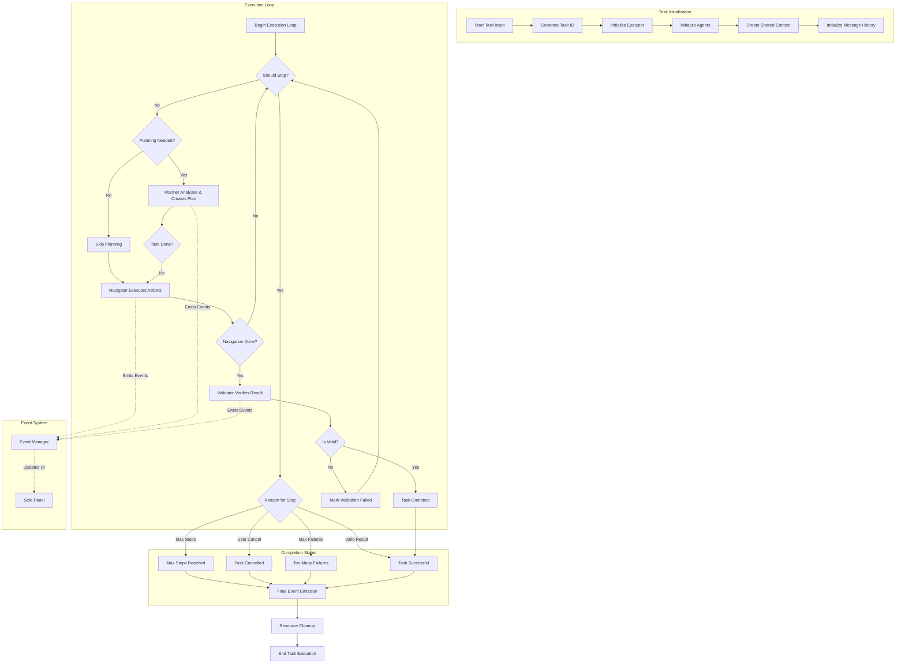

### 4. RPC Handler Implementation Flow

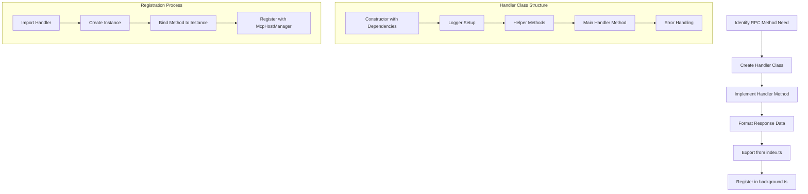

## Development Workflow

### 1. Git Workflow
- **不能直接合并到master**: 必须通过Pull Request流程
- **Pull Request要求**: 需要在 https://github.com/algonius/algonius-browser/pulls 创建PR
- **GitHub Workflow检查**: PR必须通过GitHub workflow检查后才能合并
- **分支保护**: master分支受保护，需要正式的代码审查流程

### 2. 开发流程
1. **创建feature分支**: 从master创建新的feature分支
2. **代码开发**: 在feature分支上进行开发和测试
3. **本地测试**: 在本地验证功能和修复
4. **提交和推送**: 将更改提交并推送到feature分支
5. **创建PR**: 在GitHub上创建Pull Request
6. **CI/CD检查**: 等待GitHub workflow检查通过
7. **代码审查**: 获得代码审查批准
8. **合并**: 通过检查后合并到master分支

### 3. GitHub问题管理流程

**问题验证和解决模式:**
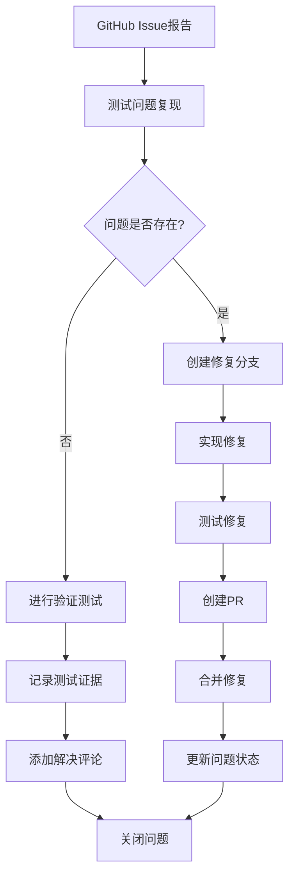

**问题解决标准流程:**
1. **验证测试**: 使用当前代码库彻底测试报告的功能
2. **证据记录**: 记录测试结果和具体证据（如成功的工具输出、响应时间等）
3. **解决评论**: 在GitHub问题上添加详细评论说明：
   - 使用的测试方法
   - 执行的具体测试案例
   - 功能按预期工作的证据
   - 原始报告可能的原因（过时版本、环境差异等）
4. **问题关闭**: 使用适当的解决标签关闭问题
5. **后续监控**: 监控是否有类似问题的其他报告

**Browser MCP工具问题管理:**
- **测试环境**: 使用Algonius Browser MCP进行实际测试
- **证据收集**: 记录工具输出、响应时间、成功/失败状态
- **文档更新**: 在记忆银行中记录测试结果和解决方案

### 3. 持续优化流程
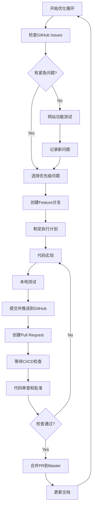

## Critical Implementation Paths

### 0. MCP Integration Path

1. **Native Messaging Setup**:
   - Native Host manifest registered with Chrome
   - Chrome extension connects to Native Host
   - Message protocol established for bidirectional communication

2. **Browser State Capture**:
   - Current browser state is monitored and captured
   - DOM structure is serialized
   - Tab information is tracked
   - State is transmitted to Native Host

3. **MCP Server Implementation**:
   - Server instance created with MCP SDK
   - Browser resources defined and registered
   - Browser tools defined with schemas
   - Resource and tool handlers implemented

4. **Resource Exposure**:
   - Browser state exposed as MCP resources
   - DOM structure provided as structured resource
   - Tab information exposed through standardized endpoints

5. **Tool Implementation**:
   - Browser operations mapped to MCP tools
   - Tool requests validated against schemas
   - Tool actions executed in browser context
   - Results returned in standardized format

6. **Error Handling**:
   - Message protocol errors handled
   - MCP request errors processed
   - Browser action errors managed
   - Results communicated back with appropriate status

### 1. Task Execution Flow
1. **Task Reception**:
   - User inputs task in side panel
   - Task ID is generated and stored
   - Executor is initialized with appropriate LLM models

2. **Executor Setup**:
   - MessageManager is initialized for agent communication
   - EventManager is created for event handling
   - AgentContext is established as shared environment
   - Agent prompts are configured for each role
   - Navigator action registry is populated with browser operations

3. **Execution Loop**:
   - System checks if execution should stop (paused, cancelled, etc.)
   - On each Nth step (based on planningInterval) or after validation failure:
     - Planner agent analyzes context and generates plan
     - Plan may indicate task completion or next steps
   - If task is not complete:
     - Navigator executes appropriate browser actions
     - Browser state is updated and recorded
   - If Navigator indicates task completion:
     - Validator agent verifies the result
     - If invalid, planning restarts with validation insight
     - If valid, task is marked complete

4. **Completion Handling**:
   - Success event emitted if task is validated as complete
   - Failure event emitted if maximum steps or failures are reached
   - Cancel event emitted if user manually stops execution
   - All browser resources are cleaned up
   - Results presented to user with follow-up capability

### 2. LLM Integration Path
1. **Model Configuration**:
   - Provider and model configuration retrieved from storage
   - Different models can be assigned to different agents:
     - Navigator model for interactive browser operations
     - Planner model for strategic planning
     - Validator model for result verification
     - Extractor model for content extraction

2. **Agent Request Preparation**:
   - Current context gathered including:
     - Task description
     - Current browser state (DOM, visual elements)
     - Action history
     - Previous agent outputs
   - Context combined with agent-specific prompt template

3. **LLM Request Processing**:
   - Request formatted according to provider API requirements
   - API call made with appropriate authentication
   - Response received and parsed
   - Error handling for authentication failures, rate limits, etc.

4. **Result Interpretation**:
   - Structured output parsed according to expected schema
   - For Navigator: Action commands extracted and validated
   - For Planner: Task decomposition and next steps identified
   - For Validator: Completion validation results processed

### 3. Browser Automation Path
1. **Action Selection**:
   - Navigator agent determines required action (from 17 available operations)
   - Action input is validated against expected schema
   - Action intent is recorded for transparency

2. **Action Execution**:
   - Appropriate browserContext method is called
   - For element interaction:
     - Elements are identified by numeric index
     - Element properties are extracted from DOM state
     - Appropriate Puppeteer calls are made to interact with elements
   - For navigation:
     - URLs are processed and validated
     - Navigation is performed with timeout handling
   - For content extraction:
     - Page state is captured
     - Content is processed according to extraction goals

3. **Result Processing**:
   - Action result is captured in standardized format
   - Success/failure is determined and recorded
   - Extracted content is preserved for context
   - Event is emitted for user visibility

4. **State Management**:
   - Updated page state is captured after action
   - New element indices are calculated for changed DOM
   - Tab state is tracked for multi-tab operations
   - Visual state is captured for vision-based operations

5. **Error Handling**:
   - Action-specific errors are caught and processed
   - Retry mechanisms engaged for transient failures
   - Consecutive failure count tracked against threshold
   - Graceful degradation for unavailable elements

### 4. RPC Handler Implementation Path

1. **Handler Class Creation**:
   - Create a new TypeScript class in the appropriate directory (e.g., `task/`)
   - Class name follows the pattern `Get[Resource]Handler` or `[Action]Handler`
   - Implement the class with proper TypeScript types and documentation

2. **Dependency Injection**:
   - Declare required dependencies in the constructor (typically BrowserContext)
   - Initialize a logger instance for consistent logging
   - Store dependencies as private class members

3. **Handler Method Implementation**:
   - Implement a public method following the RpcHandler interface
   - Method accepts an RpcRequest and returns a Promise<RpcResponse>
   - Access browser state or perform operations through the browserContext

4. **Error Handling**:
   - Implement comprehensive try/catch blocks
   - Format errors with standard error codes and messages
   - Include detailed debugging information when appropriate
   - Log errors with appropriate severity levels

5. **Response Formatting**:
   - Format responses with consistent structure
   - For state requests, include both human-readable and structured data
   - For operation requests, include success/failure status and relevant metadata
   - Format complex data as JSON with appropriate nesting

6. **Export and Registration**:
   - Export the handler class from its module
   - Add an export in task/index.ts for centralized access
   - Import and instantiate the handler in background/index.ts
   - Register the handler method with McpHostManager using method binding

### 5. MCP Tool Implementation Pattern

The project uses a consistent pattern for implementing MCP tools that expose browser functionality:

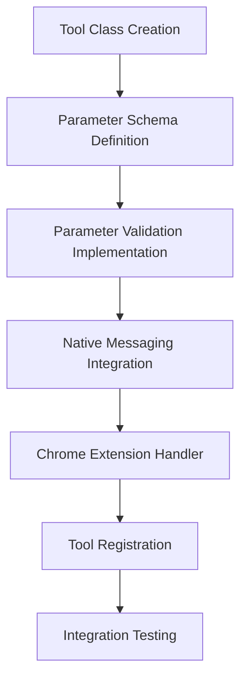

Key aspects of the MCP tool pattern include:
- **Tool Struct Implementation**: Each tool is a Go struct implementing the MCP tool interface
- **Parameter Schema**: JSON schema definition for tool parameters with proper validation
- **Parameter Validation**: Comprehensive validation of input parameters with clear error messages
- **Native Messaging Integration**: Tool requests forwarded to Chrome extension via Native Messaging
- **Chrome Extension Handler**: TypeScript handler class following RPC handler pattern
- **Tool Registration**: Centralized registration with MCP server and dependency injection
- **Integration Testing**: Comprehensive test suite covering all tool functionality

#### Current MCP Tools
1. **navigate_to Tool**: Navigate browser to specified URL
   - Parameters: `url` (string, required)
   - Validation: URL format validation
   - Actions: Page navigation with error handling

2. **scroll_page Tool**: Control page scrolling in various ways
   - Parameters: `action` (enum: up, down, to_top, to_bottom, to_element), `pixels` (number, optional), `element_index` (number, conditional)
   - Validation: Action type validation, conditional parameter validation
   - Actions: 5 different scroll operations with parameter-specific behavior

### 6. Navigator Action System

The Navigator agent can execute 17 distinct browser operations:

```mermaid
graph TD
    subgraph "Navigation Actions"
        go_to_url["go_to_url: Navigate to URL"]
        search_google["search_google: Google search"]
        go_back["go_back: Return to previous page"]
        wait["wait: Pause execution"]
    end
    
    subgraph "Element Interaction"
        click_element["click_element: Click by index"]
        input_text["input_text: Enter text in field"]
        get_dropdown_options["get_dropdown_options: List options"]
        select_dropdown_option["select_dropdown_option: Select from dropdown"]
    end
    
    subgraph "Tab Management"
        open_tab["open_tab: Open URL in new tab"]
        switch_tab["switch_tab: Change active tab"]
        close_tab["close_tab: Close tab by ID"]
    end
    
    subgraph "Page Navigation"
        scroll_down["scroll_down: Scroll page down"]
        scroll_up["scroll_up: Scroll page up"] 
        scroll_to_text["scroll_to_text: Find and scroll to text"]
    end
    
    subgraph "Special Actions"
        cache_content["cache_content: Store findings"]
        send_keys["send_keys: Send keyboard input"]
        done["done: Mark task complete"]
    end
    
    Navigator["Navigator Agent"] --> Navigation["Select Action Based on Context"]
    Navigation --> go_to_url & search_google & go_back & wait
    Navigation --> click_element & input_text & get_dropdown_options & select_dropdown_option
    Navigation --> open_tab & switch_tab & close_tab
    Navigation --> scroll_down & scroll_up & scroll_to_text
    Navigation --> cache_content & send_keys & done
```

This system architecture and these patterns provide the foundation for Algonius Browser's implementation, guiding development decisions and ensuring consistent design across the project. The detailed understanding of execution flow, agent communication, and browser automation capabilities enables effective development and troubleshooting.
