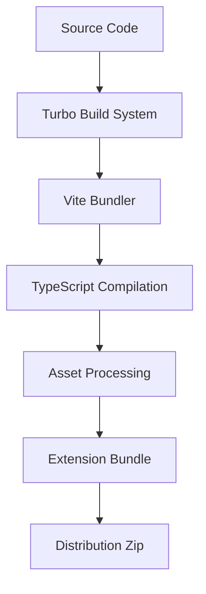
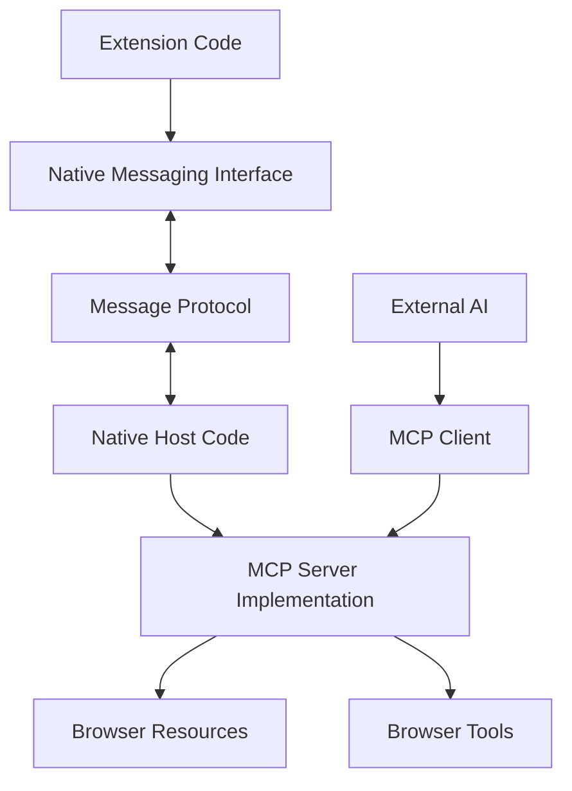

# Technical Context: Algonius Browser

## Technologies Used

### Core Technologies
- **TypeScript**: Primary programming language for type safety and developer experience
- **React**: UI library for building the extension's user interfaces
- **Chrome Extension API**: For browser integration and automation
- **Chrome Native Messaging**: For communication between extension and local applications
- **Model Context Protocol (MCP)**: For standardized AI model interaction with browser
- **Vite**: Modern bundler for fast development and optimized production builds
- **Tailwind CSS**: Utility-first CSS framework for styling

### Package Management & Build System
- **pnpm**: Fast, disk-efficient package manager with workspace support
- **Turbo**: Build system for monorepo optimization
- **ESBuild**: JavaScript bundler used by Vite for high-performance builds
- **Go Modules**: Go's built-in dependency management for MCP host
- **Make**: Build automation tool for Go MCP host with comprehensive targets

### Testing & Quality
- **Vitest**: Modern, Vite-native testing framework for unit and integration tests
- **Jest**: Traditional testing framework (being migrated to Vitest)
- **ESLint**: JavaScript and TypeScript linting
- **Prettier**: Code formatting
- **Husky**: Git hooks for pre-commit validation
- **lint-staged**: Run linters on staged files

### State Management
- **Chrome Storage API**: For persisting extension state and user preferences
- **React Context**: For component-level state management
- **Native Messaging Protocol**: For state exchange with local MCP server

### LLM Integration
- **OpenAI API**: Integration with OpenAI models
- **Anthropic API**: Integration with Claude models
- **Gemini API**: Integration with Google's Gemini models
- **Ollama**: Integration with locally-run models
- **MCP SDK**: For exposing browser capabilities to external AI systems

## Development Setup

### Environment Requirements
- **Node.js**: v22.12.0 or higher
- **pnpm**: v9.15.1 or higher
- **Chrome**: Latest version for extension testing
- **MCP SDK**: For developing MCP server implementations

### Project Structure
The project follows a monorepo structure using pnpm workspaces:

```
algonius-browser/
├── chrome-extension/     # Main extension implementation
│   ├── src/
│   │   ├── background/   # Background script components
│   │   │   ├── mcp/      # MCP integration components
├── docs/                 # Documentation
│   ├── chrome-mcp-host.md # MCP integration documentation
├── packages/             # Shared packages
│   ├── dev-utils/        # Development utilities
│   ├── hmr/              # Hot Module Replacement
│   ├── i18n/             # Internationalization
│   ├── schema-utils/     # Schema validation
│   ├── shared/           # Shared utilities
│   ├── storage/          # Storage abstractions
│   ├── tailwind-config/  # Shared Tailwind configuration
│   ├── tsconfig/         # Shared TypeScript configurations
│   ├── ui/               # Shared UI components
│   └── vite-config/      # Shared Vite configuration
├── pages/                # Extension pages
│   ├── content/          # Content script
│   ├── options/          # Options page
│   └── side-panel/       # Side panel UI
```

### Development Workflow
1. **Installation**: `pnpm install`
2. **Development**: `pnpm dev` (with hot reloading)
3. **Building**: `pnpm build`
4. **Testing**: Manual testing in Chrome
5. **Packaging**: `pnpm zip` creates distributable extension
6. **MCP Development**: Separate workflow for Native Messaging Host development

### Chrome Extension Loading
- **Development**: Load unpacked extension from `dist` directory
- **Production**: Install from Chrome Web Store
- **Manual Installation**: Load from downloaded zip file

## Technical Constraints

### Browser Limitations
- **Extension API Constraints**: Limited by what Chrome Extension API allows
- **Content Script Isolation**: Content scripts run in isolated contexts
- **Cross-Origin Restrictions**: Standard web security practices apply
- **Manifest V3 Limitations**: Working within Chrome's extension manifest V3 constraints
- **Native Messaging Restrictions**: Security limitations on Native Messaging communication

### Performance Considerations
- **LLM Response Time**: Dependent on external API response times
- **Browser Resource Usage**: Extensions share resources with browser
- **Token Limitations**: LLM APIs have context window constraints
- **Storage Limitations**: Chrome storage has size limits
- **Native Messaging Overhead**: Buffer management for message passing

### API Constraints
- **Rate Limiting**: LLM APIs have usage limits
- **Latency**: Network latency affects real-time interactions
- **Token Costs**: LLM API usage incurs costs based on tokens
- **Native Messaging Security**: Only authorized extensions can communicate
- **MCP Protocol Limitations**: Working within MCP specification constraints

### Browser Compatibility
- **Chrome-First**: Primarily designed for Chrome
- **Firefox Compatibility**: Secondary support for Firefox with specific adaptations
- **Native Messaging Support**: Varies between browsers and platforms

## Dependencies

### Production Dependencies
- **React**: ^18.3.1
- **React DOM**: ^18.3.1
- **Tailwind CSS**: For utility-first styling
- **MCP SDK**: For Model Context Protocol implementation

### Development Dependencies
- **TypeScript**: 5.5.4
- **Vite**: 6.0.12
- **ESLint**: 8.57.0
- **Prettier**: ^3.3.3
- **Turbo**: ^2.3.3
- **Husky**: ^9.1.4
- **lint-staged**: ^15.2.7
- **Chrome Types**: ^0.0.270

### External Services
- **OpenAI API**: For GPT model access
- **Anthropic API**: For Claude model access
- **Google AI API**: For Gemini model access
- **External AI Systems**: For MCP client connections

## Tool Usage Patterns

### Build Process


### MCP Integration Process


1. **Development Build**: Fast builds with HMR for immediate feedback
2. **Production Build**: Optimized, minified builds for distribution
3. **Firefox Build**: Adapted builds for Firefox compatibility

### Code Quality Workflow
- **Pre-commit**: Husky runs lint-staged to ensure code quality
- **Linting**: ESLint checks code for errors and style issues
- **Formatting**: Prettier ensures consistent code style
- **Type Checking**: TypeScript validates type correctness

### Version Management
- **Package Versioning**: Controlled via `update_version.sh` script
- **Monorepo Dependencies**: Managed by pnpm workspace
- **Chrome Store Deployment**: Manual upload of built zip file

### Extension Development Patterns
- **Background Script Development**: Long-running extension processes
- **Content Script Injection**: Web page interaction scripts
- **Side Panel Development**: UI for user interaction
- **Options Page Development**: Configuration interface
- **Storage Management**: Persistent data handling
- **Native Messaging Integration**: Communication with external processes
- **MCP Server Implementation**: Exposing browser capabilities via MCP

## Go MCP Host Build System

### Go Environment Requirements
- **Go**: 1.21 or higher
- **Make**: GNU Make for build automation
- **Chrome/Chromium**: For Native Messaging Host registration

### Go MCP Host Structure
```
mcp-host-go/
├── cmd/mcp-host/         # Main application entry point
├── pkg/                  # Core packages
│   ├── handlers/        # RPC and request handlers
│   ├── logger/          # Structured logging
│   ├── messaging/       # Chrome Native Messaging protocol
│   ├── resources/       # MCP resource implementations
│   ├── sse/             # SSE-based MCP server
│   ├── tools/           # MCP tool implementations
│   └── types/           # Shared types and interfaces
├── tests/               # Integration testing suite
│   └── integration/     # Integration test environment
├── manifest/            # Chrome Native Messaging manifests
├── bin/                 # Build artifacts (gitignored)
├── Makefile            # Build automation
├── install.sh          # Installation script
└── uninstall.sh        # Cleanup script
```

### Build System Features
The Go MCP host uses a comprehensive Makefile with the following capabilities:

#### Build Targets
- **`make build`**: Compile optimized binary with build flags
- **`make build-all`**: Cross-platform builds (Linux, macOS, Windows)
- **`make run`**: Build and execute the binary
- **`make clean`**: Remove build artifacts and clean Go cache

#### Development Targets
- **`make test`**: Run all tests with verbose output
- **`make lint`**: Run golangci-lint for code quality
- **`make vet`**: Run Go vet for code analysis
- **`make deps`**: Update dependencies and tidy modules
- **`make tidy`**: Clean up Go module dependencies

#### Installation Targets
- **`make install`**: Build and install the MCP host system-wide
- **`make uninstall`**: Remove installed components and cleanup

#### Build Configuration
```makefile
# Build flags for optimization
LDFLAGS=-ldflags "-s -w"          # Strip symbols and debug info
BUILD_FLAGS=-trimpath             # Remove file system paths
BUILD_DIR=bin                     # Unified build directory
```

### Installation Process
The installation system provides intelligent binary management:

1. **Smart Binary Detection**: `install.sh` checks for existing binary in `bin/`
2. **Conditional Building**: Only rebuilds if binary doesn't exist
3. **System Integration**: 
   - Copies binary to `~/.nanobrowser/bin/`
   - Creates Chrome Native Messaging manifest
   - Registers with Chrome/Chromium browsers
4. **Manifest Generation**: Auto-generates manifest with correct binary path

### Git Configuration
Comprehensive `.gitignore` covering Go development patterns:
- **Build Artifacts**: `bin/`, `build/`, `*.exe`, `*.dll`, `*.so`
- **Go Files**: `vendor/`, `*.test`, `*.out`, `go.work`, `go.work.sum`
- **Development Tools**: `.idea/`, `.vscode/`, `*.swp`, `*.swo`
- **System Files**: `.DS_Store`, `Thumbs.db`, `desktop.ini`
- **Logs and Temporary**: `*.log`, `*.tmp`, `*.temp`
- **Testing**: `coverage.out`, `*.cover`, `*.prof`, `*.pprof`

### Build System Optimizations (2025-05-24)
Recent improvements to the build system include:

1. **Warning Resolution**: 
   - Eliminated Makefile "overriding recipe" warnings
   - Changed BUILD_DIR from 'build' to 'bin' for consistency
   - Resolved circular dependency issues

2. **Workflow Optimization**:
   - Simplified install target to directly call install.sh
   - Removed redundant file copying operations
   - Streamlined build process with unified directory usage

3. **Script Enhancement**:
   - Updated install.sh to use existing binaries when available
   - Added intelligent binary detection and conditional building
   - Improved path consistency across build tools

### Cross-Platform Support
- **Linux**: Primary development and deployment platform
- **macOS**: Full support with proper manifest registration
- **Windows**: Cross-compilation support with .exe handling

### Dependencies Management
- **Go Modules**: Automatic dependency resolution and versioning
- **mark3labs/mcp-go**: Industry-standard MCP library for SSE support
- **Clean Architecture**: Minimal external dependencies with clear interfaces

This technical context provides the foundation for understanding the development environment, constraints, and practices used in the Algonius Browser project.
