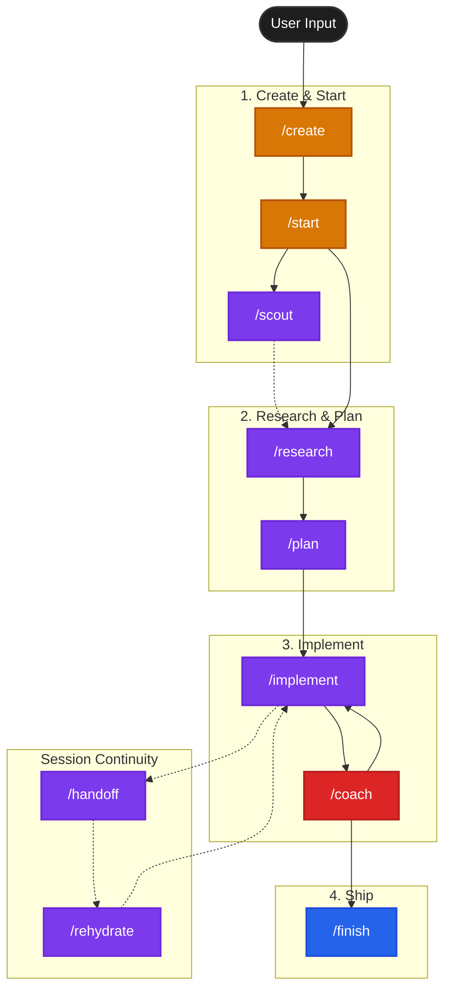

# OpenCode Agentic Workflow

```
  __  __                 _
 |  \/  |               | |
 | \  / | __ _  ___  ___| |_ _ __ ___
 | |\/| |/ _` |/ _ \/ __| __| '__/ _ \
 | |  | | (_| |  __/\__ \ |_| | | (_) |
 |_|  |_|\__,_|\___||___/\__|_|  \___/
           OpenCode Maestro
```

A structured, high-context workflow for [OpenCode](https://opencode.ai) + [oh-my-opencode](https://github.com/code-yeongyu/oh-my-opencode), aligned with:
- [ACE-FCA](https://github.com/humanlayer/advanced-context-engineering-for-coding-agents) (Advanced Context Engineering - Frequent Intentional Compaction)
- [Claude 4 Best Practices](https://platform.claude.com/docs/en/build-with-claude/prompt-engineering/claude-4-best-practices)
- [Block's Dialectical Autocoding](https://block.xyz/documents/adversarial-cooperation-in-code-synthesis.pdf) (Coach-Player adversarial cooperation)

It utilizes **Beads** (Issue Tracking), **Git Worktrees**, and **oh-my-opencode** (multi-model agents) to manage agent context and isolation.

## Philosophy

This workflow implements the **"Frequent Intentional Compaction"** methodology:

> "A bad line of code is a bad line of code. But a bad line of a **plan** could lead to hundreds of bad lines of code. And a bad line of **research** could land you with thousands of bad lines of code."

### Core Principles

1. **Human as Orchestrator** - You drive; agents execute
2. **Frequent Intentional Compaction** - Each phase is fresh context (subtask)
3. **Artifacts over Memory** - Persist to `.beads/artifacts/` (specs, research, plans)
4. **High-Leverage Human Review** - Review research and plans, not just code
5. **Research → Plan → Implement** - Mandatory sequence
6. **Context Quality** - Correctness > completeness > noise; compact early and keep context utilization ~40–60%

### OpenCode Defaults (Use These)

- Run OpenCode `/init` per repo to generate `AGENTS.md` (commit it).
- Use the built-in Plan agent (Tab) for `/research` + `/plan`.
- Use the built-in Build agent (Tab) for `/implement` + `/finish`.
- Use `/undo` + `/redo` whenever a prompt goes sideways.
- Use `/compact` to reduce chat noise; use `/handoff` + `/rehydrate` for bead continuity across sessions.
- Use `/sessions` (OpenCode’s built-in `/resume` alias) to navigate between parent and subagent sessions.
- Avoid overriding built-in commands (hence `/rehydrate`, not a custom `/resume`).



## The 10-Command Workflow

```
/create                   →  Interview → bead + spec.md (uses templates)
      ↓
/start [bead-id]          →  bd ready → setup workspace → explore → exploration-context.md
      ↓
/scout <target>           →  Quick async exploration (fire-and-forget, optional)
      ↓
/research <bead-id>       →  INTERACTIVE: Explore → present findings → iterate → research.md
      │                       (back-and-forth conversation IS the review)
      ↓
/plan <bead-id>           →  INTERACTIVE: Generate → walk through phases → iterate → plan.md
      │                       (iterate IN the conversation until approved, child beads created after)
      ↓
/implement <bead-id>      →  Execute plan with coach checkpoints (max 10 turns/phase)
      │                       ↓
      │                   /coach <bead-id>  →  Adversarial validation against spec.md
      │                       ↓
      │                   [Coach APPROVED?] → Continue / Address feedback
      ↓
   [Tests + Lint + Coach MUST pass] ← HARD GATE
      ↓
/finish <bead-id>         →  Coach review → commit + close

Session Continuity (use anytime):
──────────────────────────────────
/handoff                  →  Create handoff document (context approaching limit)
/rehydrate                →  Resume from latest handoff (new session)
```

### Always-Interactive Research & Planning

Both `/research` and `/plan` are **always interactive**. The conversation IS the review:

| Phase | What Happens |
|-------|--------------|
| **Research** | Agent explores → presents findings → you discuss → agent digs deeper or pivots → iterate until you approve |
| **Plan** | Agent generates → presents approach → walks through phases (depth based on risk) → you discuss → iterate until you approve → child beads created |

**Key behaviors:**
- Agent uses judgment to determine engagement depth (auth changes = more detail, UI tweaks = faster)
- Agent will push back if your feedback seems incorrect (with evidence)
- Agent flags uncertainties explicitly rather than hiding them
- Child beads created ONLY after plan is finalized (not during)

This prevents "rubber-stamping" - you can't just type "approve" without engaging.

### Completion Gates (Non-Negotiable)

A bead **CANNOT** be marked complete until:
- Build passes
- **ALL** tests pass (existing + new)
- Lint passes (if present)
- All tests specified in plan's "Testing Strategy" are written

## The Stack

- **[OpenCode](https://opencode.ai)**: The AI Coding Agent
- **[oh-my-opencode](https://github.com/code-yeongyu/oh-my-opencode)**: Multi-model agent orchestration plugin
- **[Beads (bd)](https://github.com/steveyegge/beads)**: Lightweight, CLI-first issue tracking that lives in git
- **[HumanLayer](https://github.com/humanlayer/humanlayer)**: Creators of the ACE-FCA methodology

## Design Decisions

### Why Beads (vs Pure Git)

We evaluated using pure git (branches + plan.md phases) but chose Beads for:

| Feature | Pure Git | Beads |
|---------|----------|-------|
| **Dependency tracking** | None | `blocks`, `related`, `parent-child`, `discovered-from` |
| **Ready work detection** | Manual | `bd ready` instantly shows unblocked work |
| **Multi-agent coordination** | Branch conflicts | Hash-based IDs prevent collisions |
| **Hierarchical work breakdown** | Manual in plan.md | `bd-xxx.1`, `bd-xxx.2` native support |
| **Discovered work linking** | Manual notes | `discovered-from` auto-links to parent |
| **Memory decay** | Manual cleanup | Automatic compaction of old issues |

**Bottom line:** Beads provides dependency-aware issue tracking that git alone cannot replicate.

### Why Commands (vs Skills)

We evaluated Claude Code Skills (model-invoked SKILL.md files) but chose OpenCode commands for:

| Aspect | Skills | Commands |
|--------|--------|----------|
| **Invocation** | Model-invoked (Claude decides) | User-invoked (`/research`) |
| **Workflow control** | Claude might skip steps | You control the sequence |
| **ACE-FCA alignment** | Weaker - agent might bypass | Perfect - "human as orchestrator" |
| **Review points** | Implicit | Explicit - you run each command |

**Bottom line:** ACE-FCA emphasizes "human as orchestrator" - explicit commands ensure the Research -> Plan -> Implement sequence is followed. Skills would allow Claude to rationalize skipping steps.

### Artifact Files

**Decision:** Artifacts are working files, not permanent documentation. Delete after PR merge.

| Artifact | During Work | After PR Merge |
|----------|-------------|----------------|
| `spec.md` | `.beads/artifacts/<bead-id>/` | Bead metadata suffices |
| `research.md` | `.beads/artifacts/<bead-id>/` | Delete |
| `plan.md` | `.beads/artifacts/<bead-id>/` | Delete |
| `review.md` | `.beads/artifacts/<bead-id>/` | Delete |
| `handoffs/` | `.beads/artifacts/<bead-id>/` | Delete |

**Rationale:**
- Artifacts exist to guide implementation, not as permanent documentation
- PR description captures the "why" for posterity
- Git history has the "what" (the actual changes)
- Keeping stale artifacts creates confusion

## Installation

### Prerequisites

1. **[OpenCode](https://opencode.ai)**: Install OpenCode first
2. **[oh-my-opencode](https://github.com/code-yeongyu/oh-my-opencode)** (recommended): Multi-model agent orchestration
   - Add `"oh-my-opencode"` to the `plugin` array in `~/.config/opencode/opencode.json`
   - Follow the oh-my-opencode README for model authentication setup

### Install Workflow Commands

```bash
# Local install (current project only)
/bin/bash -c "$(curl -fsSL https://raw.githubusercontent.com/lleewwiiss/opencode-maestro/main/install.sh)"

# Global install (~/.config/opencode/)
/bin/bash -c "$(curl -fsSL https://raw.githubusercontent.com/lleewwiiss/opencode-maestro/main/install.sh)" -- -g
```

## What it installs

### Slash Commands (`.opencode/command/`)

| Command | Purpose |
|---------|---------|
| `/create` | Interview → bead + spec.md |
| `/start [bead-id]` | Find/setup bead, load context |
| `/scout <target>` | Quick async exploration (fire-and-forget) |
| `/research <bead-id>` | **Interactive:** explore → present → iterate → research.md |
| `/plan <bead-id>` | **Interactive:** generate → walk through → iterate until approved → plan.md + child beads |
| `/implement <bead-id>` | Execute plan with coach checkpoints |
| `/coach <bead-id>` | Adversarial validation against spec.md |
| `/finish [bead-id]` | Coach review → commit + sync + push |
| `/handoff` | Create handoff for session continuity |
| `/rehydrate` | Resume from latest handoff |

### Subagents (`.opencode/agent/`)

| Agent | Purpose |
|-------|---------|
| `codebase-analyzer` | Deep code understanding with file:line refs (LSP-enabled) |
| `codebase-pattern-finder` | Find similar implementations (AST-grep enabled) |

**Note:** oh-my-opencode provides additional agents: `explore`, `librarian`, `oracle`, `frontend-ui-ux-engineer`, `document-writer`, `multimodal-looker`

### Protocols

- `AGENTIC_WORKFLOW.md`: The master protocol document

## Usage

1. **Start**: `opencode`
2. **Initialize (once per repo)**: `/init` → review + commit `AGENTS.md`
3. **Create Work**: `/create` (interview → bead + spec)
4. **Pick Work**: `/start` (or `/start bd-xxx` for specific bead)
5. **Deep Work**: The agent guides you through `/research` → `/plan` → `/implement`
6. **Ship**: `/finish` (commits, syncs beads, pushes)

### Session Continuity

When context window approaches limit:
1. Run `/handoff` to capture current state
2. End session gracefully  
3. Start new session with `/rehydrate`
4. Continue work seamlessly from handoff

## Human Review Points

| After | Review | Why |
|-------|--------|-----|
| `/create` | `spec.md` | Ensure problem is well-defined |
| `/research` | **Interactive dialogue** | Bad research = bad plan = bad code. The conversation IS the review. |
| `/plan` | **Interactive dialogue** | Approve approach AND each phase before implementation. Child beads created after. |
| `/finish` | Commits + PR | Final validation |

**Note:** `/research` and `/plan` no longer produce artifacts for passive review. You engage directly with the agent, iterate, and only proceed when satisfied.

## Artifacts

Artifacts are **local-only working files** - never committed to git. The `/start` command auto-adds `.beads/artifacts/` to `.gitignore`.

**Why local-only?**
- Artifacts contain session-specific working state (research notes, draft plans, handoffs)
- They become stale quickly and would clutter git history
- Different developers may have different artifacts for the same bead
- The PR description and git history are the permanent record; artifacts are ephemeral

```
.beads/
└── artifacts/           # ← In .gitignore, never committed
    └── <bead-id>/
        ├── spec.md                # Created by /create
        ├── exploration-context.md # Created by /start (seeds /research)
        ├── research.md            # Created by /research
        ├── plan.md                # Created by /plan
        ├── review.md              # Created by /finish
        └── handoffs/              # Session continuity
            └── YYYY-MM-DD_HH-MM-SS_handoff.md
```
