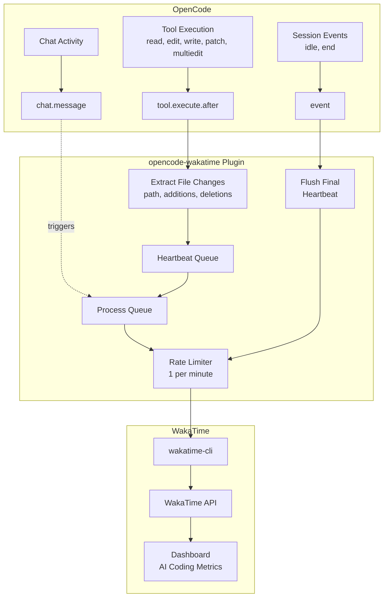

# opencode-wakatime

[](https://www.npmjs.com/package/opencode-wakatime)
[](https://www.npmjs.com/package/opencode-wakatime)
[](https://github.com/angristan/opencode-wakatime/actions/workflows/workflow.yml)
[](LICENSE)

WakaTime plugin for [OpenCode](https://github.com/sst/opencode) - Track your AI coding activity, lines of code, and time spent.

Inspired by [claude-code-wakatime](https://github.com/wakatime/claude-code-wakatime).

> [!TIP]
> Also check out [codex-wakatime](https://github.com/angristan/codex-wakatime) for OpenAI Codex CLI!

## Features

- **Automatic CLI management** - Downloads and updates wakatime-cli automatically
- **Detailed file tracking** - Tracks file reads and modifications (edit, write, patch, multiedit)
- **AI coding metrics** - Sends `--ai-line-changes` for WakaTime AI coding analytics
- **Rate-limited heartbeats** - 1 per minute to avoid API spam
- **Session lifecycle** - Sends final heartbeat on session idle/end

## Prerequisites

### WakaTime API Key

Ensure you have a WakaTime API key configured in `~/.wakatime.cfg`:

```ini
[settings]
api_key = waka_your_api_key_here
```

You can get your API key from [WakaTime Settings](https://wakatime.com/settings/api-key).

### WakaTime CLI (Optional)

The plugin will automatically download wakatime-cli if not found. However, you can also install it manually:

**macOS:**

```bash
brew install wakatime-cli
```

**Other platforms:**
Download from [WakaTime releases](https://github.com/wakatime/wakatime-cli/releases/latest).

## Installation

### Via npm (recommended)

```bash
npm i -g opencode-wakatime
opencode-wakatime --install
```

This installs the plugin to `~/.config/opencode/plugin/wakatime.js`.

To update, run the same commands again.

### From source

```bash
git clone https://github.com/angristan/opencode-wakatime
cd opencode-wakatime
npm install && npm run build
node bin/cli.js --install
```

The plugin will be automatically loaded by OpenCode - no configuration needed.

## How It Works

The plugin hooks into OpenCode's event system:



### Hooks Used

| Hook                 | Purpose                                   |
| -------------------- | ----------------------------------------- |
| `tool.execute.after` | Tracks file modifications from tools      |
| `chat.message`       | Triggers heartbeat processing on activity |
| `event`              | Listens for session lifecycle events      |

### Tool Tracking

| Tool        | Data Extracted                                    |
| ----------- | ------------------------------------------------- |
| `read`      | File path (from title)                            |
| `edit`      | File path, additions, deletions (from `filediff`) |
| `write`     | File path, new file detection                     |
| `patch`     | File paths from output, diff count                |
| `multiedit` | File paths and changes from each edit result      |

### Heartbeat Data

Each heartbeat includes:

- **Entity**: File path being worked on
- **Project folder**: Working directory
- **AI line changes**: Net lines added/removed (`additions - deletions`)
- **Category**: "ai coding"
- **Plugin identifier**: `opencode/1.0.0 opencode-wakatime/1.0.0`

## Files

| File                                  | Purpose                          |
| ------------------------------------- | -------------------------------- |
| `~/.wakatime/opencode.log`            | Debug logs                       |
| `~/.wakatime/opencode.json`           | State (last heartbeat timestamp) |
| `~/.wakatime/opencode-cli-state.json` | CLI version tracking             |
| `~/.wakatime/wakatime-cli-*`          | Auto-downloaded CLI binary       |

## Development

```bash
# Install dependencies
npm install

# Type check
npm run typecheck

# Build
npm run build
```

## Troubleshooting

### Plugin not loading

1. Check your config file syntax (`opencode.jsonc`)
2. Verify the plugin path is correct
3. Check logs at `~/.wakatime/opencode.log`

### Heartbeats not sending

1. Verify API key in `~/.wakatime.cfg`
2. Check if wakatime-cli is working: `wakatime-cli --version`
3. Enable debug logging and check `~/.wakatime/opencode.log`

### CLI not downloading

1. Check network connectivity
2. Verify write permissions to `~/.wakatime/`
3. Manually install: `brew install wakatime-cli`

## License

MIT
