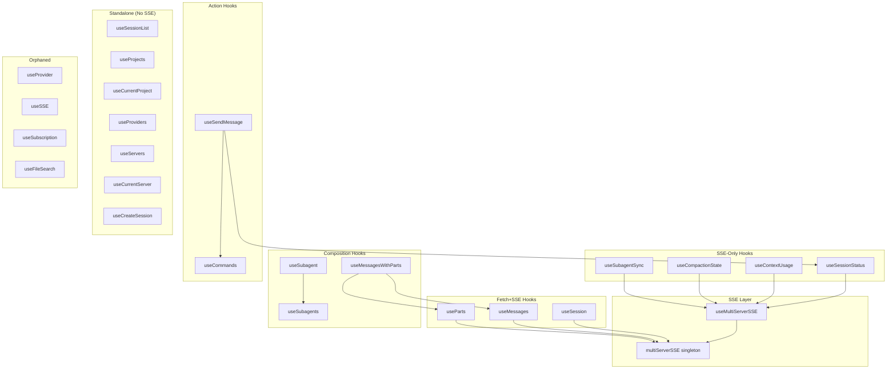

# React Hooks Architecture Audit

## Executive Summary

The `packages/react/src/hooks/` directory contains **22 hooks** (excluding tests) that bridge OpenCode's Promise-based API to React state. The architecture follows a consistent pattern but has significant duplication opportunities.

### Key Findings

| Category | Finding | Impact |
|----------|---------|--------|
| **Duplication** | 10 hooks share identical fetch+state pattern (~400 LOC) | High - consolidation could reduce by ~60% |
| **SSE Pattern** | 3 different SSE integration approaches | Medium - should standardize |
| **Dead Code** | 5 hooks with no detected usage in `apps/web` | Low - may be future APIs |
| **Coupling** | `useProvider` has internal stub (orphaned) | Medium - needs migration |
| **Abstraction Gap** | No generic `useFetch<T>` or `useSSEResource<T>` | High - missed opportunity |

### Recommended Actions

1. **Create `useFetchWithState<T>` generic hook** - eliminate ~350 LOC of duplication
2. **Create `useSSEResource<T>` generic hook** - standardize SSE+fetch pattern
3. **Deprecate or delete orphaned hooks** - `useProvider`, `useSSE`, `useSubscription`
4. **Migrate `useSendMessage` to use core API** - remove internal stubs

---

## Pattern Inventory

### Pattern 1: Fetch + State (Most Common)

**Description**: Fetch data on mount, manage loading/error/data states, expose refetch.

**Occurrences**: 10 hooks (~1,000 LOC total)

| Hook | Entity | SSE? | LOC |
|------|--------|------|-----|
| `useSessionList` | Session[] | No | 88 |
| `useSession` | Session | Yes | 117 |
| `useMessages` | Message[] | Yes | 146 |
| `useParts` | Part[] | Yes | 148 |
| `useProjects` | Project[] | No | 147 |
| `useCurrentProject` | Project | No | (in useProjects) |
| `useProviders` | Provider[] | No | 91 |
| `useServers` | ServerInfo[] | No | 163 |
| `useCurrentServer` | ServerInfo | No | (in useServers) |
| `useCommands` | SlashCommand[] | No | 130 |

**Canonical Implementation** (from `useSessionList`):
```typescript
export function useSessionList(options = {}): UseSessionListReturn {
  const [sessionList, setSessionList] = useState<Session[]>([])
  const [loading, setLoading] = useState(true)
  const [error, setError] = useState<Error | null>(null)

  const fetch = useCallback(() => {
    setLoading(true)
    setError(null)
    
    sessions.list(options.directory)
      .then((data) => { setSessionList(data); setError(null) })
      .catch((err) => { setError(err); setSessionList([]) })
      .finally(() => setLoading(false))
  }, [options.directory])

  useEffect(() => { fetch() }, [fetch])

  return { sessions: sessionList, loading, error, refetch: fetch }
}
```

**Duplication Analysis**:
- State setup: 3 lines x 10 = 30 lines
- Fetch callback: 15 lines x 10 = 150 lines  
- useEffect: 3 lines x 10 = 30 lines
- Return: 1 line x 10 = 10 lines
- **Total duplicated**: ~220 lines (excludes SSE variants)

---

### Pattern 2: Fetch + SSE Updates

**Description**: Initial fetch + subscribe to SSE for real-time updates with binary search.

**Occurrences**: 3 hooks

| Hook | Entity | Binary Search | LOC |
|------|--------|---------------|-----|
| `useSession` | Session | No | 117 |
| `useMessages` | Message[] | Yes | 146 |
| `useParts` | Part[] | Yes | 148 |

**Key Features**:
- `sessionIdRef` to avoid stale closures
- `hydratedRef` to skip initial fetch when SSR data provided
- `fetchInProgressRef` to skip SSE updates during fetch
- Binary search for O(log n) updates

**Example** (from `useMessages`):
```typescript
useEffect(() => {
  const unsubscribe = multiServerSSE.onEvent((event) => {
    if (fetchInProgressRef.current) return
    if (event.payload.type !== "message.updated") return
    
    const messageData = event.payload.properties.info
    if (messageData.sessionID !== sessionIdRef.current) return
    
    setMessageList((prev) => {
      const { found, index } = Binary.search(prev, messageData.id, (m) => m.id)
      if (found) {
        const updated = [...prev]
        updated[index] = messageData
        return updated
      }
      return Binary.insert(prev, messageData, (m) => m.id)
    })
  })
  return unsubscribe
}, [])
```

---

### Pattern 3: SSE-Only (No Initial Fetch)

**Description**: Subscribe to SSE events only, no initial API fetch.

**Occurrences**: 4 hooks

| Hook | Events | LOC |
|------|--------|-----|
| `useMultiServerSSE` | All events | 64 |
| `useContextUsage` | Token events | 147 |
| `useCompactionState` | compaction.* | 102 |
| `useSessionStatus` | session.status | 154 |

**Common Pattern**:
```typescript
useMultiServerSSE({
  onEvent: (event) => {
    if (event.payload.type !== "target.event") return
    if (event.payload.properties.sessionID !== sessionId) return
    setState(/* derived from event */)
  }
})
```

---

### Pattern 4: Composition Hooks

**Description**: Compose multiple hooks into unified API.

**Occurrences**: 2 hooks

| Hook | Composes | LOC |
|------|----------|-----|
| `useMessagesWithParts` | useMessages + useParts | 122 |
| `useSubagent` | useSubagents (filtered) | 94 |

---

### Pattern 5: Action Hooks (Mutations)

**Description**: Provide async action function + loading/error states.

**Occurrences**: 2 hooks

| Hook | Action | LOC |
|------|--------|-----|
| `useCreateSession` | sessions.create() | 109 |
| `useSendMessage` | sessions.promptAsync() | 269 |

---

### Pattern 6: Utility Hooks

**Description**: Non-data hooks for UI behavior.

**Occurrences**: 2 hooks

| Hook | Purpose | LOC |
|------|---------|-----|
| `useLiveTime` | Tick counter for relative time | 35 |
| `useSubscription` | Generic async iterable + visibility API | 154 |

---

## Duplication Analysis

### Identical Code Blocks

| Pattern | Occurrences | LOC per Hook | Total Waste |
|---------|-------------|--------------|-------------|
| useState triplet (data/loading/error) | 10 | 3 | 30 |
| Error normalization | 10 | 3 | 30 |
| Fetch callback structure | 10 | 15 | 150 |
| useEffect fetch trigger | 10 | 3 | 30 |
| SSE subscription boilerplate | 4 | 12 | 48 |
| Binary search update pattern | 2 | 15 | 30 |
| **Total Waste** | | | **~318 LOC** |

### Before/After with Generic Hook

**Before** (~88 LOC each):
```typescript
// useSessionList.ts
export function useSessionList(options = {}) {
  const [sessionList, setSessionList] = useState<Session[]>([])
  const [loading, setLoading] = useState(true)
  const [error, setError] = useState<Error | null>(null)
  // ... 80 more lines
}

// useProjects.ts
export function useProjects() {
  const [projectList, setProjectList] = useState<Project[]>([])
  const [loading, setLoading] = useState(true)
  const [error, setError] = useState<Error | null>(null)
  // ... 80 more lines
}
```

**After** (~15 LOC each):
```typescript
// use-fetch.ts (new generic)
export function useFetch<T, P = void>(
  fetcher: (params: P) => Promise<T>,
  params: P,
  initialData: T
): UseFetchReturn<T> { /* ~50 LOC */ }

// useSessionList.ts
export function useSessionList(options = {}) {
  return useFetch(
    (dir) => sessions.list(dir),
    options.directory,
    []
  )
}

// useProjects.ts
export function useProjects() {
  return useFetch(() => projects.list(), undefined, [])
}
```

**Estimated Reduction**: ~350 LOC (10 hooks x 35 LOC savings)

---

## Proposed Abstractions

### 1. `useFetch<T>` - Generic Fetch Hook

```typescript
interface UseFetchReturn<T> {
  data: T
  loading: boolean
  error: Error | null
  refetch: () => void
}

function useFetch<T, P = void>(
  fetcher: (params: P) => Promise<T>,
  params: P,
  options?: { initialData?: T }
): UseFetchReturn<T>
```

**Would Replace**: 7 hooks with simple fetch patterns

### 2. `useSSEResource<T>` - Fetch + SSE Updates

```typescript
interface UseSSEResourceOptions<T> {
  fetcher: () => Promise<T[]>
  eventType: string
  sessionIdFilter?: string
  getId: (item: T) => string
  initialData?: T[]
}

function useSSEResource<T>(options: UseSSEResourceOptions<T>): {
  data: T[]
  loading: boolean
  error: Error | null
  refetch: () => void
}
```

**Would Replace**: `useMessages`, `useParts`, `useSession` (3 hooks)

### 3. `useSSEState<T>` - SSE-Only State

```typescript
interface UseSSEStateOptions<T> {
  eventType: string | ((type: string) => boolean)
  sessionIdFilter?: string
  reducer: (state: T, event: GlobalEvent) => T
  initialState: T
}

function useSSEState<T>(options: UseSSEStateOptions<T>): T
```

**Would Replace**: `useContextUsage`, `useCompactionState`, `useSessionStatus` (3 hooks)

---

## Dead Code Candidates

### Confirmed Unused

| Hook | LOC | Reason | Recommendation |
|------|-----|--------|----------------|
| `useProvider` | 182 | Has internal stub, uses old SSE API | **Delete** - orphaned during migration |
| `useSSE` | 130 | Native EventSource, not used in apps/web | **Keep** - public API for consumers |
| `useSubscription` | 154 | Generic async iterable, no callers | **Keep** - useful pattern |
| `useFileSearch` | 127 | Uses old client stub pattern | **Migrate** - update to core API |

### Analysis Method

1. Searched `apps/web/**/*.tsx` for hook imports
2. Checked index.ts exports
3. Cross-referenced with test files

### Hooks Used in apps/web

| Hook | Used In |
|------|---------|
| `useMessagesWithParts` | session-messages.tsx |
| `useSessionStatus` | session-messages.tsx, session-status.tsx |
| `useSSE` | session-status.tsx |
| `useContextUsage` | context-usage.tsx |
| `useCompactionState` | compaction-indicator.tsx |

---

## Dependency Diagram



---

## Coupling Analysis

### Tight Coupling (Red Flags)

| Source | Target | Issue |
|--------|--------|-------|
| `useProvider` | internal stub | Has local `globalClient` and `useSSE` stubs |
| `useFileSearch` | client-stub.ts | Uses old `createClient` pattern |
| `useSendMessage` | internal stub | Has local `useSessionStatus` stub |

### Healthy Coupling (Good)

| Source | Target | Relationship |
|--------|--------|--------------|
| All SSE hooks | `multiServerSSE` singleton | Single source of truth |
| `useMessagesWithParts` | `useMessages`, `useParts` | Clean composition |
| Action hooks | `@opencode-vibe/core/api` | Uses Promise API |

---

## Recommendations

### Priority 1: Create Generic Hooks (High Impact)

1. **Create `useFetch<T>`** in `packages/react/src/hooks/use-fetch.ts`
2. **Create `useSSEResource<T>`** in `packages/react/src/hooks/use-sse-resource.ts`
3. **Refactor** 10+ hooks to use generics

**Estimated Effort**: 4-6 hours  
**LOC Reduction**: ~350 lines

### Priority 2: Clean Up Orphaned Code (Medium Impact)

1. **Delete `useProvider`** - orphaned during migration, has stubs
2. **Migrate `useFileSearch`** - update to use `@opencode-vibe/core/api`
3. **Migrate `useSendMessage`** - remove internal stub

**Estimated Effort**: 2-3 hours

### Priority 3: Standardize SSE Pattern (Medium Impact)

1. All SSE hooks should use `useMultiServerSSE`
2. Remove direct `multiServerSSE.onEvent` calls
3. Consider `useSSEState<T>` abstraction

**Estimated Effort**: 2 hours

### Priority 4: Export Cleanup (Low Impact)

1. Review `index.ts` exports
2. Mark internal hooks with `@internal` JSDoc
3. Consider separating public vs internal exports

---

## Metrics Summary

| Metric | Current | After Refactor |
|--------|---------|----------------|
| Total Hooks | 22 | 15-18 |
| Total LOC | ~2,800 | ~1,800 |
| Duplicated LOC | ~350 | ~50 |
| SSE Patterns | 3 | 1 |
| Orphaned Hooks | 4 | 0 |

---

## Appendix: Hook Inventory

### All Hooks (Sorted by LOC)

| Hook | LOC | Pattern | SSE? | Used? |
|------|-----|---------|------|-------|
| `useSendMessage` | 269 | Action | Indirect | Likely |
| `useProvider` | 182 | Fetch | Stub | **No** |
| `useSubagents` | 176 | State | No | Yes |
| `useServers` | 163 | Fetch x2 | No | Unknown |
| `useSessionStatus` | 154 | SSE-only | Yes | Yes |
| `useSubscription` | 154 | Utility | N/A | **No** |
| `useParts` | 148 | Fetch+SSE | Yes | Via composition |
| `useProjects` | 147 | Fetch x2 | No | Unknown |
| `useContextUsage` | 147 | SSE-only | Yes | Yes |
| `useMessages` | 146 | Fetch+SSE | Yes | Via composition |
| `useSubagentSync` | 137 | SSE-only | Yes | Unknown |
| `useCommands` | 130 | Fetch | No | Yes |
| `useSSE` | 130 | SSE | Native | Yes |
| `useFileSearch` | 127 | Fetch | No | **No** |
| `useMessagesWithParts` | 122 | Composition | Via deps | Yes |
| `useSession` | 117 | Fetch+SSE | Yes | Unknown |
| `useCreateSession` | 109 | Action | No | Unknown |
| `useCompactionState` | 102 | SSE-only | Yes | Yes |
| `useSubagent` | 94 | Composition | Via deps | Unknown |
| `useProviders` | 91 | Fetch | No | Unknown |
| `useSessionList` | 88 | Fetch | No | Unknown |
| `useMultiServerSSE` | 64 | SSE | Singleton | Yes |
| `useLiveTime` | 35 | Utility | No | Unknown |

**Total**: ~2,800 LOC across 22 hooks
